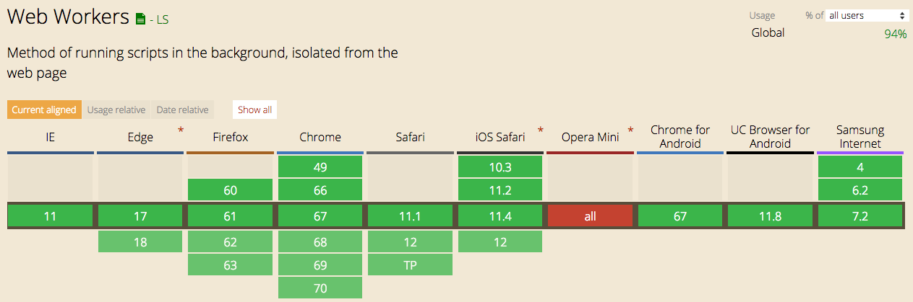

# Web Workers 調用 API，減輕主執行緒負擔

> Web Worker 是 HTML5 中引入的一種技術,它允許 JavaScript 在後台線程中執行任務,而不會阻塞主瀏覽器線程。這意味著 Web Worker 可以讓您的 Web 應用程序在後台執行一些耗時的運算或 I/O 操作,而不會影響網頁的響應和交互。

## 瀏覽器支援度


圖片來源：[Can I use…Web Workers]('https://caniuse.com/webworkers')

## 具體來說,Web Worker 有以下幾個特點:

1. 獨立執行:Web Worker 運行在獨立的線程中,與主瀏覽器線程隔離,不會相互干擾。
2. 無法訪問 DOM:Web Worker 無法直接訪問和操作 DOM,但可以通過消息傳遞與主線程通信。
3. 事件驅動:Web Worker 通過事件處理機制與主線程進行交互和通訊。
4. 數據共享:Web Worker 可以通過 postMessage() 和 onmessage 事件在主線程和 Worker 線程間傳遞資料。
5. 跨域:Web Worker 支持跨域載入腳本資源。

## Web Worker 的主要應用場景包括:

1. 長時間運算任務(如資料分析、機器學習等)
2. 網頁背景任務(如拉取資料、更新快取等)
3. 資料流處理(如音視頻編碼/解碼)

## Web Worker 的局限性

1. **受限的 DOM 訪問：**
    > Web Worker 不能直接訪問主執行緒中的 DOM。因此，它們無法操作網頁的用戶介面，只能通過訊息傳遞與主執行緒進行通信。
2. **受限的環境：**
    > Web Worker 運行在一個獨立的上下文中，因此無法訪問主執行緒中的全域變數和對象。它們只能訪問有限的 API，例如 setTimeout、setInterval、XMLHttpRequest 和一些 HTML5 API（如 IndexedDB）。
3. **資源消耗：**
    > 創建和管理 Web Worker 會增加資源消耗，特別是在需要大量 Worker 的情況下。每個 Worker 都有自己的執行緒，這可能會導致高記憶體和 CPU 使用率。
4. **跨來源限制：**
    > 出於安全考量，Web Worker 受到同源策略的限制，這意味著它們只能載入與起始腳本同源的資源。這限制了從不同來源加載資源的靈活性。
5. **除錯困難：**
    > 由於 Web Worker 在獨立執行緒中運行，除錯變得更加困難。傳統的除錯工具可能無法完全支持 Worker 的調試，這增加了開發和除錯的複雜性。
6. **無法使用某些功能：**
    > Web Worker 無法使用一些主執行緒中可用的功能和 API，例如 alert、confirm 和 localStorage 等。

## 問題

1.  **Web Worker 是否能與主線程共享數據?**

    Web Worker 與主線程確實是在獨立的執行環境中運行的,它們之間無法直接共享數據。但是,Web Worker 提供了一種專門的機制來實現主線程與 Worker 線程之間的數據傳遞和通信,那就是使用 postMessage() 方法和 onmessage 事件。

            通常情況下,Web Worker 會在後台執行一些耗時的任務,並將計算結果通過 postMessage() 方法傳遞給主線程。主線程則會通過 onmessage 事件監聽 Worker 發送的訊息,並對其進行相應的處理。

            舉個例子,比如在 Worker 線程中進行一個大型的數據運算,當運算完成後,就可以將結果通過 postMessage() 發送給主線程,主線程接收到這個消息後,就可以將結果顯示在網頁上。

            此外,如果需要在主線程和 Worker 線程之間傳遞較大的數據,可以考慮使用 Transferable Objects 技術,這可以實現無需複製數據就能在線程間傳遞。

            總的來說,雖然 Web Worker 與主線程是隔離的,但通過 postMessage()/onmessage 機制,它們仍然能夠實現數據的有效共享和通信。這為開發高性能的 Web 應用程序提供了很好的支持。

2.  **哪些情況下使用 Web Worker 有助於提高網頁效能?**

    1.  長時間運算任務

        -   如果網頁中有一些需要進行大量計算的任務,例如資料分析、機器學習等,這些任務如果在主線程中執行會阻塞瀏覽器的主事件循環,導致網頁出現卡頓或無響應的情況。
        -   將這類耗時的任務放在 Web Worker 中執行,可以讓主線程保持響應,提高整個網頁的流暢性。

    2.  網頁背景任務

        -   一些網頁背景任務,例如資料拉取、快取更新等,如果在主線程中執行也可能影響網頁的整體效能。

        -   將這些任務放在 Web Worker 中執行,可以讓主線程專注於處理使用者的交互操作,提升用戶體驗。

    3.  資料流處理

        -   對於一些需要持續處理資料流的任務,例如音視頻的編碼/解碼,如果在主線程中執行可能導致卡頓或延遲。
        -   使用 Web Worker 可以將這些任務放在後台執行,確保主線程能夠流暢地處理使用者輸入和繪製畫面。

    4.  離線運算

        -   當網路環境不穩定時,將一些運算任務放在 Web Worker 中執行,可以確保即使在網路中斷的情況下,這些任務也能夠繼續進行,提高應用程序的可用性。

## 範例

### 原生 Javascript

```code
// './worker.js' 你要引入的動畫效果 或是 執行 function
const worker = new Worker("./worker.js");

// 從主線發送訊息
worker.postMessage({ data: '從主線發送訊息' });

// 主線程接收消息
worker.onmessage = (e) => {
    const { data } = e;
    if (!data) return;
    console.log(data);
}
```

#### 終止

**方法一**

```code
worker.terminate();
```

**方法一**

```code
self.close();
```

### 使用 vueUse 的 useWebWorkerFn

```code
import { useWebWorkerFn } from '@vueuse/core'

const { workerFn, workerStatus, workerTerminate } = useWebWorkerFn(
  dates => dates.sort(dateFns.compareAsc),
  {
    timeout: 50000,
    dependencies: [
      'https://cdnjs.cloudflare.com/ajax/libs/date-fns/1.30.1/date_fns.js', // dateFns
    ],
  },
)
```

參考 : [vueUse-useWebWorkerFn](https://vueuse.org/core/useWebWorkerFn/#source)

> 在建立 Web Worker 之前，請檢查使用者的瀏覽器是否支援它
