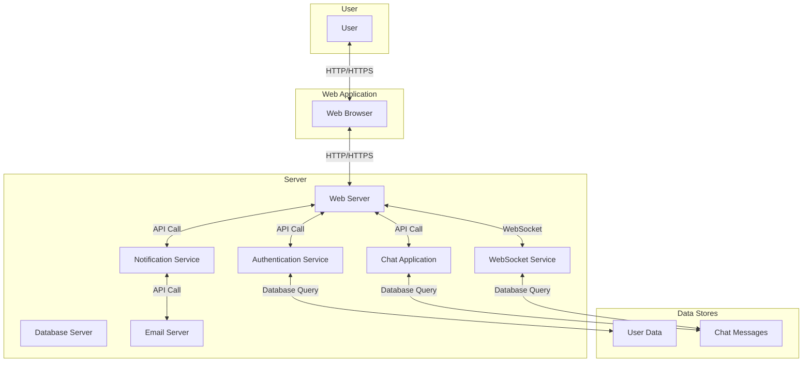
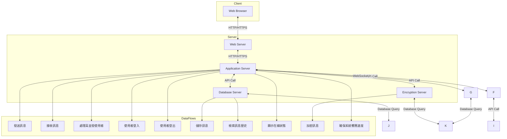

### Data Flow Diagram

```mermaid

graph TD
    subgraph User
        A[User]
    end

    subgraph Web Application
        B[Web Browser]
    end

    subgraph Server
        C[Web Server]
        D[Authentication Service]
        E[Chat Application]
        F[Notification Service]
        G[WebSocket Service]
        H[Database Server]
        I[Email Server]
    end

    subgraph Data Stores
        J[User Data]
        K[Chat Messages]
    end

    A <-->|HTTP/HTTPS| B
    B <-->|HTTP/HTTPS| C
    C <-->|API Call| D
    C <-->|API Call| E
    C <-->|API Call| F
    C <-->|WebSocket| G
    D <-->|Database Query| J
    E <-->|Database Query| K
    F <-->|API Call| I
    G <-->|Database Query| K


```

```mermaid
graph TD
    subgraph Client
        A[Web Browser]
    end

    subgraph Server
        B[Web Server]
        C[Application Server]
        D[Database Server]
        E[Encryption Server]
    end

    A <--> |HTTP/HTTPS| B
    B <--> |HTTP/HTTPS| C
    C <--> |API Call| D
    C <--> |API Call| E
    C <--> |API Call| F
    C <--> |WebSocket| G
    D <--> |Database Query| J
    E <--> |Database Query| K
    F <--> |API Call| I
    G <--> |Database Query| K

    subgraph DataFlows
        DF1[發送訊息]
        DF2[接收訊息]
        DF3[處理高並發使用者]
        DF4[使用者登入]
        DF5[使用者登出]
        DF6[儲存訊息]
        DF7[檢索訊息歷史]
        DF8[顯示在線狀態]
        DF9[加密訊息]
        DF10[確保系統響應速度]
    end

    C --> DF1
    C --> DF2
    C --> DF3
    C --> DF4
    C --> DF5
    D --> DF6
    D --> DF7
    C --> DF8
    E --> DF9
    C --> DF10
```
