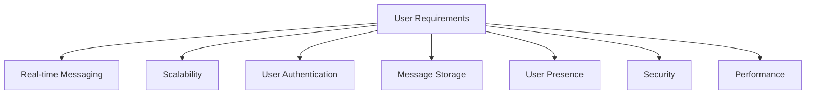
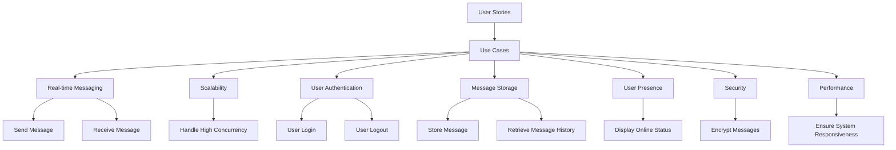

```mermaid
graph TD
    A[User Requirements] --> B[Real-time Messaging]
    A --> C[Scalability]
    A --> D[User Authentication]
    A --> E[Message Storage]
    A --> F[User Presence]
    A --> G[Security]
    A --> H[Performance]
```

```mermaid
graph TD
    A[User Stories] --> B[Use Cases]

    B --> C[Real-time Messaging]
    C --> D[Send Message]
    C --> E[Receive Message]

    B --> F[Scalability]
    F --> G[Handle High Concurrency]

    B --> H[User Authentication]
    H --> I[User Login]
    H --> J[User Logout]

    B --> K[Message Storage]
    K --> L[Store Message]
    K --> M[Retrieve Message History]

    B --> N[User Presence]
    N --> O[Display Online Status]

    B --> P[Security]
    P --> Q[Encrypt Messages]

    B --> R[Performance]
    R --> S[Ensure System Responsiveness]
```
