### Use Case Diagram

```mermaid
flowchart LR
    subgraph 'Chat System'
    uc1((Register))
    uc2((Login))
    uc3((Join Chatroom))
    uc4((Send Message))
    uc5((Receive Message))
    uc6((Logout))

    end
    u[User👤]

    u----uc1
    u----uc2
    u----uc3
    u----uc4
    u----uc5
    u----uc6
```

```mermaid
sequenceDiagram
    participant User as 用戶
    participant Client as 客戶端
    participant API as API服務器
    participant DB as 資料庫

    User->>Client: 發送請求
    Client->>API: 發送API請求
    API->>DB: 查詢資料
    DB-->>API: 返回資料
    API-->>Client: 返回API響應
    Client-->>User: 返回結果

    alt 異常情況
        API->>Client: 錯誤信息
        Client-->>User: 顯示錯誤
    end

```





```mermaid
graph TD
    subgraph 即時訊息
        A1[發送訊息]
        A2[接收訊息]
    end

    subgraph 可擴展性
        B1[處理高並發使用者]
    end

    subgraph 使用者認證
        C1[使用者登入]
        C2[使用者登出]
    end

    subgraph 訊息儲存
        D1[儲存訊息]
        D2[檢索訊息歷史]
    end

    subgraph 使用者狀態
        E1[顯示在線狀態]
    end

    subgraph 安全性
        F1[加密訊息]
    end

    subgraph 性能
        G1[確保系統響應速度]
    end

    User[使用者] --> A1
    User --> A2
    User --> C1
    User --> C2
    User --> D2
    User --> E1

    Admin[系統管理員] --> B1
    Admin --> G1

    System[系統] --> D1
    System --> F1
```
