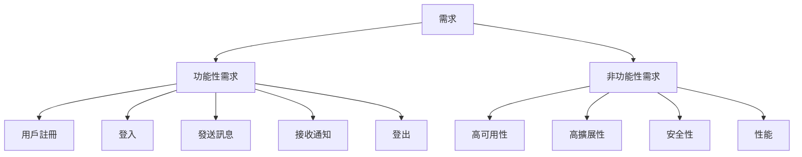
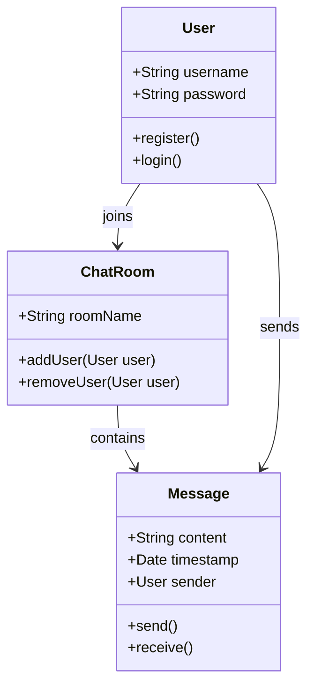
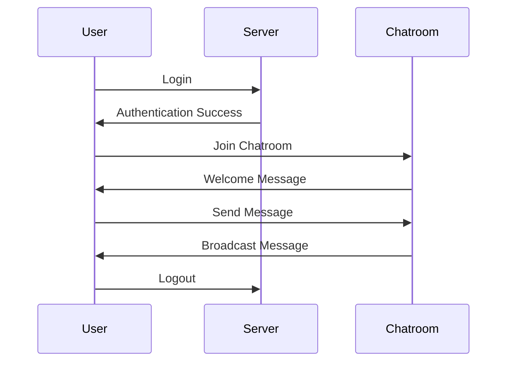

https://mermaid.live/

```mermaid
graph TD
    A[需求] --> B[功能性需求]
    A --> C[非功能性需求]
    B --> D[用戶註冊]
    B --> E[登入]
    B --> F[發送訊息]
    B --> G[接收通知]
    B --> H[登出]
    C --> I[高可用性]
    C --> J[高擴展性]
    C --> K[安全性]
    C --> L[性能]
```

```mermaid
classDiagram
    class User {
        +String username
        +String password
        +register()
        +login()
    }
    class ChatRoom {
        +String roomName
        +addUser(User user)
        +removeUser(User user)
    }
    class Message {
        +String content
        +Date timestamp
        +User sender
        +send()
        +receive()
    }
    User --> ChatRoom : joins
    ChatRoom --> Message : contains
    User --> Message : sends

```

```mermaid
sequenceDiagram
    participant User
    participant Server
    participant Chatroom
    User ->> Server: Login
    Server ->> User: Authentication Success
    User ->> Chatroom: Join Chatroom
    Chatroom ->> User: Welcome Message
    User ->> Chatroom: Send Message
    Chatroom ->> User: Broadcast Message
    User ->> Server: Logout
```
