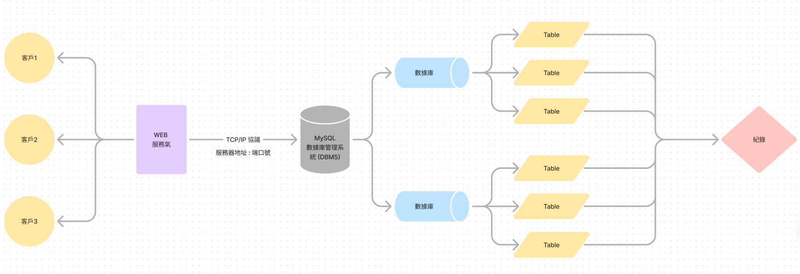
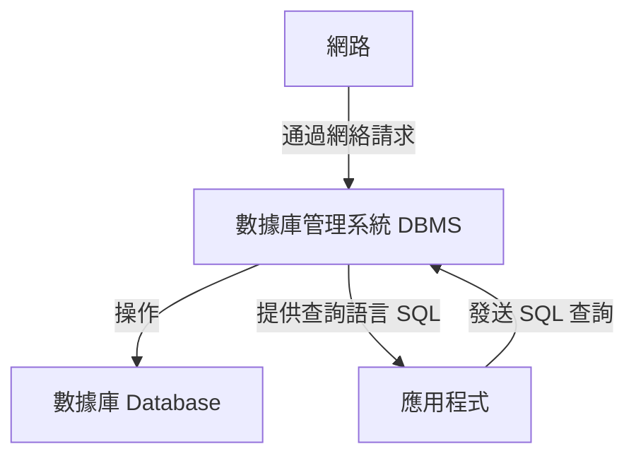

> 數據庫能夠提供持久化的資料儲存，這意味著資料可以長期保存於硬碟等永久儲存裝置中，即使系統重啟或發生故障，資料也不會丟失。除此之外，數據庫還支持多用戶的並發訪問和操作，並透過權限控制保護資料的安全性。資料的一致性和完整性由數據庫的約束條件維護，防止資料錯誤或重複。數據庫還具備強大的查詢功能，使資料能夠快速檢索和分析，為決策提供支持。此外，數據庫系統提供備份和恢復功能，確保業務的連續性和資料的可靠性。

> 總之，數據庫透過資料持久化、資料安全、並發控制和資料分析等功能，成為現代企業在資料管理中不可或缺的工具。

### 數據庫相關概念

1. **數據庫（Database）**  
   數據庫是一種有組織的資料集合，用於儲存、管理和檢索資料。資料在數據庫中通常以表格的形式進行組織，表格由行（紀錄）和列（欄位）組成。數據庫可以用於儲存各種類型的資料，例如用戶資訊、交易記錄、產品資料等。主要目的是為了有效且安全地保存和管理大量資料，使得資料能夠輕鬆地被訪問、分析和更新。

2. **數據庫管理系統（Database Management System, DBMS）**  
   數據庫管理系統是一種軟體，用於創建、管理和操作數據庫。DBMS負責資料的存取、處理和維護，並提供查詢、更新、備份、安全性控制等功能。DBMS還管理資料的一致性和完整性，允許多用戶同時訪問並操作資料。常見的數據庫管理系統包括MySQL、Oracle、PostgreSQL、Microsoft SQL Server等。

3. **結構化查詢語言（Structured Query Language, SQL）**  
   SQL是一種專門用於與數據庫互動的語言，提供了查詢、插入、更新、刪除資料的指令。SQL語法簡單且易於學習，使得用戶可以輕鬆地對數據庫進行操作。SQL主要用於從數據庫中檢索資料（查詢）、添加新資料（插入）、修改已有資料（更新）以及移除不需要的資料（刪除）。SQL也是數據庫管理系統中最常用的查詢語言。

這些概念相互關聯，共同構成了數據庫技術的基礎。數據庫存儲資料，DBMS負責管理這些資料，而SQL則是與數據庫進行溝通的橋樑。

目前我無法直接產生 Mermaid 圖表，但可以提供 Mermaid 語法的範例，你可以將它複製到支援 Mermaid 語法的工具中（如 Markdown 編輯器、Mermaid Live Editor）來生成圖表。

以下是描述數據庫、數據庫管理系統（DBMS）及網絡之間關係的 Mermaid 語法：

> 說明：
    1. **網路（A）**：是數據庫管理系統與應用程式之間的通信媒介，用戶或應用程式通過網絡連接到 DBMS。
    2. **數據庫管理系統 (DBMS)（B）**：負責管理數據庫中的資料，接收網絡請求並對數據庫進行操作，然後將結果返回給請求方。
    3. **數據庫 (Database)（C）**：儲存實際的資料，由 DBMS 進行操作和管理。
    4. **應用程式（D）**：向 DBMS 發送 SQL 查詢請求，通過網絡與 DBMS 交互，並從數據庫中獲取所需資料。

