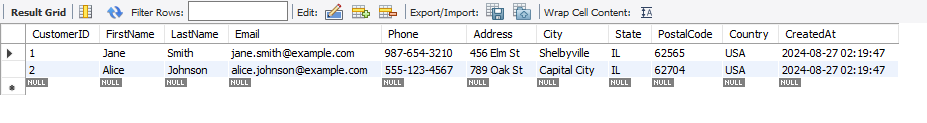
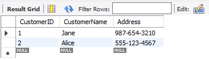
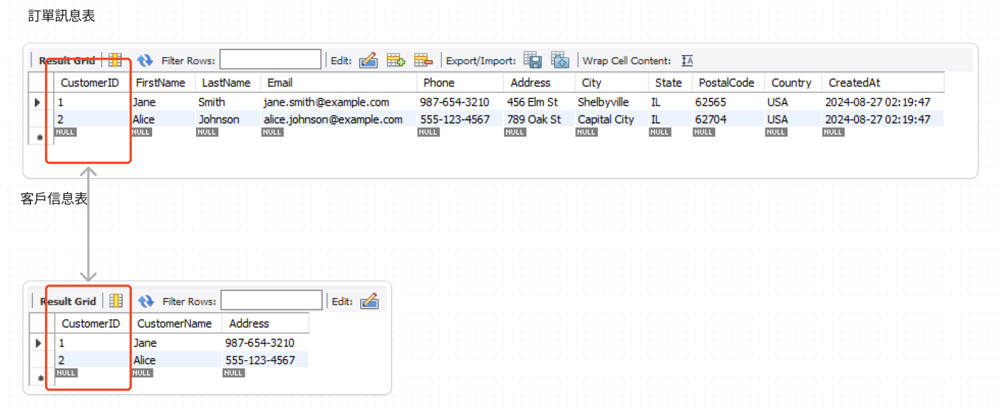

### 關聯性資料庫
- 建立在關聯模型基礎的資料庫
- 由多張能互動連接的二維表組成的資料庫

### 優點
1. 皆使用表結格式一致易維護
2. 使用通用的SQL 語言操作，使用方便可用於複雜查詢
3. 資料存於磁碟中安全

以下是用表格呈現的客戶信息表和訂單信息表的設計：

### 客戶信息表（Customers）
1. SQL Type 設定

| 列名        | 類型           | 描述               |
|-------------|----------------|--------------------|
| `CustomerID` | INT            | 主鍵，自增          |
| `FirstName`  | VARCHAR(50)    | 名字               |
| `LastName`   | VARCHAR(50)    | 姓氏               |
| `Email`      | VARCHAR(100)   | 電子郵件，唯一      |
| `Phone`      | VARCHAR(15)    | 電話號碼           |
| `Address`    | VARCHAR(255)   | 地址               |
| `City`       | VARCHAR(50)    | 城市               |
| `State`      | VARCHAR(50)    | 州/省              |
| `PostalCode` | VARCHAR(10)    | 郵政編碼           |
| `Country`    | VARCHAR(50)    | 國家               |
| `CreatedAt`  | TIMESTAMP      | 創建時間，默認當前時間 |

2. SQL 下法

```sql
CREATE DATABASE CustomerDB;
CREATE TABLE Customers (
    CustomerID INT PRIMARY KEY AUTO_INCREMENT,
    FirstName VARCHAR(50) NOT NULL,
    LastName VARCHAR(50) NOT NULL,
    Email VARCHAR(100) UNIQUE NOT NULL,
    Phone VARCHAR(15),
    Address VARCHAR(255),
    City VARCHAR(50),
    State VARCHAR(50),
    PostalCode VARCHAR(10),
    Country VARCHAR(50),
    CreatedAt TIMESTAMP DEFAULT CURRENT_TIMESTAMP
);

INSERT INTO Customers (FirstName, LastName, Email, Phone, Address, City, State, PostalCode, Country)
VALUES 
('Jane', 'Smith', 'jane.smith@example.com', '987-654-3210', '456 Elm St', 'Shelbyville', 'IL', '62565', 'USA'),
('Alice', 'Johnson', 'alice.johnson@example.com', '555-123-4567', '789 Oak St', 'Capital City', 'IL', '62704', 'USA');

SELECT * from Customers;
```


3. table 實際呈現




### 訂單信息表（Orders）

1. SQL Type 設定

| 列名        | 類型           | 描述               |
|-------------|----------------|--------------------|
| `OrderID`   | INT            | 主鍵，自增          |
| `CustomerID`| INT            | 外鍵，引用 `Customers` 表中的 `CustomerID` |
| `OrderDate` | TIMESTAMP      | 訂單日期，默認當前時間 |
| `TotalAmount`| DECIMAL(10, 2)| 總金額             |
| `Status`    | VARCHAR(50)    | 訂單狀態           |

2. SQL 下法

```sql
CREATE TABLE Orders (
    CustomerID INT PRIMARY KEY AUTO_INCREMENT,
    CustomerName VARCHAR(50) NOT NULL,
    Address VARCHAR(255)
);
INSERT INTO Orders (CustomerName, Address)
VALUES 
('Jane', '987-654-3210'),
('Alice', '555-123-4567');

SELECT * from Orders;
```

3. table 實際呈現




### 兩個 TABLE 關聯查詢

