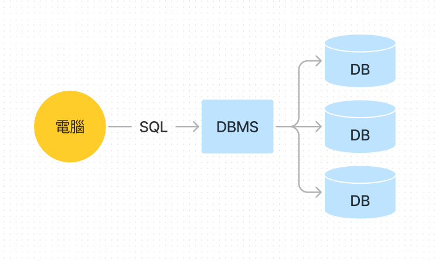
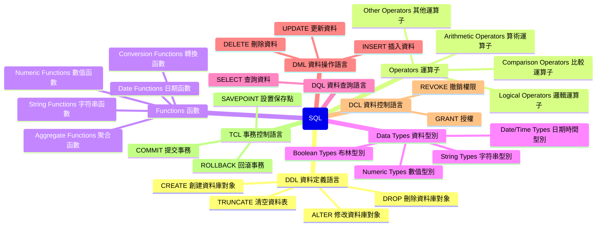

## sql 相關概念: 
**1. 資料庫 DataBase :** 儲存資料的倉庫，資料有組織的儲存

**2. 資料庫管理系統 DataBase Management System :** 管理DB軟體

**3. SQL (Structured Query Language)** 結構化查詢語言: 
   - 定義操作所有關聯資料庫的統一標準
   - 操作關聯資料庫的語言

**4. 以下是將 SQL 的各個部分以心智圖形式表示的 Mermaid 語法：**

> SQL 要學習的很多繼續努力 加油加油 !!!

