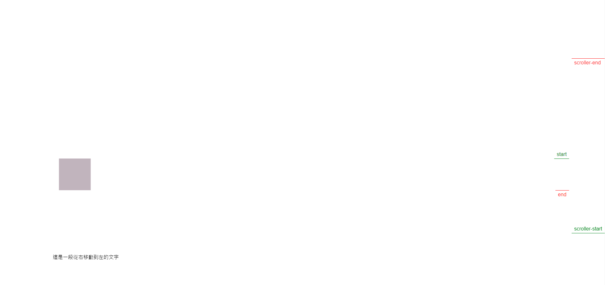
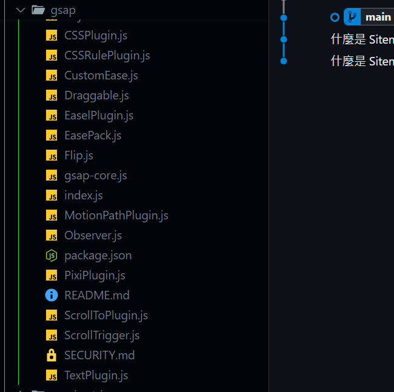

> 簡單套用 gas 幾個小功能

> 使用 套件

```html
<script src="https://cdnjs.cloudflare.com/ajax/libs/gsap/3.9.1/gsap.min.js"></script>
<script src="https://cdnjs.cloudflare.com/ajax/libs/gsap/3.9.1/ScrollTrigger.min.js"></script>
```

> HTML

```html
<div class="demo"></div>
<section class="text-box">
    <div class="text" id="scrollText" aria-hidden="true">這是一段從右移動到左的文字</div>
</section>
```

> CSS

```css
body {
    height: 6000px;
}

.demo {
    margin-top: 500px;
    opacity: 0;
    width: 100px;
    height: 100px;
    background-color: #29a2ff;
}
```

```js
gsap.registerPlugin(ScrollTrigger)

let demo = gsap.timeline({
    scrollTrigger: {
        /*
         * ⚠ start: 表示動畫開始執行節點
         * ⚠ end: 表示動畫執行結束
         * 參數1: 表示目前這個元素的開始執行動畫的起點
         * 【0：就是當前這個元素的頂端位置】
         * 【正數：目前這個元素根據頂端位置進行向下偏移】
         * 【負數：目前這個元素根據頂端位置進行向上偏移】
         *
         * 參數2: 表示目前捲軸的起點執行位置
         * 【0：瀏覽器最頂端】
         * 【正數：向下偏移】
         * 【負數：向上偏移】
         * 當兩個位置重疊時，動畫開始執行/結束
         * 此處的位置可以使用像素單位，完全可以自訂
         */
        trigger: '.demo',
        start: 'top 80%',
        end: 'bottom 20%',
        scrub: true,
        markers: true,
    },
})

demo.to('.demo', 2, {
    x: 300,
    backgroundColor: '#dd6942',
    opacity: 1,
})

// 初始化 GSAP 動畫
gsap.fromTo(
    '#scrollText',
    { x: 300, y: 200 }, // 文字從視窗右邊外面開始
    {
        x: -300, // 文字移動到視窗左邊外面
        y: 200,
        scrollTrigger: {
            trigger: '#scrollText', // 以 #scrollText 作為滾動觸發點
            // start: "top center", // 當元素頂部到達視窗中間時觸發
            // end: "bottom top", // 當元素底部到達視窗頂部時結束動畫
            scrub: true, // 使動畫與滾動同步
        },
    }
)
```

## vue Gsap

### Gsap npm 套件免費可使用的功能



如果要用其他特殊功能例如常使用的 "ScrollSmoother " 會需要 買付費版，如果你像試用可以用 CDN 方式試用，[詳情請見官網]('https://gsap.com/docs/v3/Installation/?tab=cdn&module=esm&method=private+registry&tier=club&club=true&require=false&trial=true&club-plugins=ScrollSmoother')
