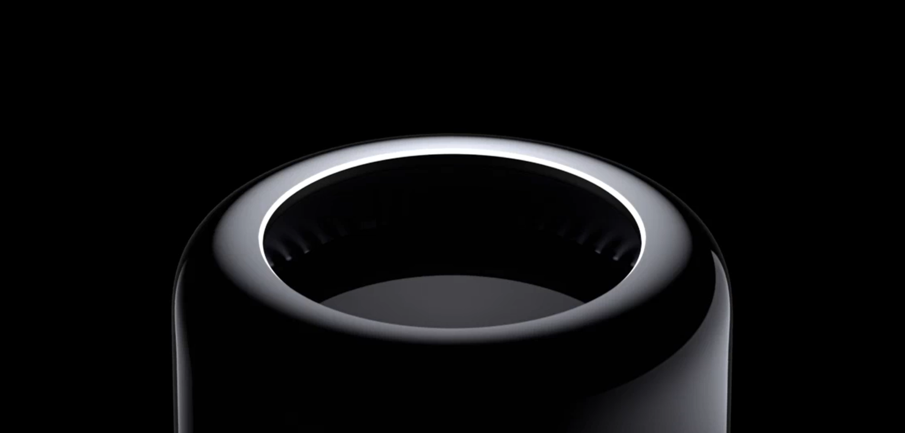

> 你有想過用控制視窗卷軸來播放影片 ?

> HTML

```html
<video id="videId" src="https://www.apple.com/media/us/mac-pro/2013/16C1b6b5-1d91-4fef-891e-ff2fc1c1bb58/videos/macpro_main_desktop.mp4" style="position: fixed; top: 0; left: 0; width: 100%" muted></video>
```

```js
let playbackConst = 200
let videoEl = document.getElementById('videId')
// Use requestAnimationFrame for smooth playback
function scrollPlay() {
    // 設定目前影片播放位置 = 頁面捲動距離 / playbackConst 常數 // 多少 s
    // 常數值越小，單位滾動距離，播放的影片時長越長。有可能滾動一小段影片就結束了。
    // 因此，這個 playbackConst 值需要可能會視訊時間長度、頁面滾動高度來設定適當的值
    var frameNumber = window.pageYOffset / playbackConst
    videoEl.currentTime = frameNumber
    // console.log(videoEl.currentTime);
    window.requestAnimationFrame(scrollPlay)
}
window.requestAnimationFrame(scrollPlay)
```
