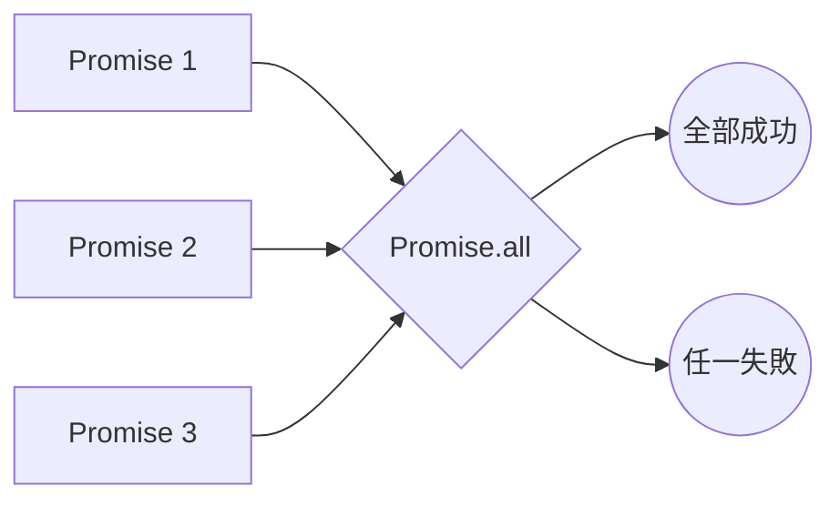
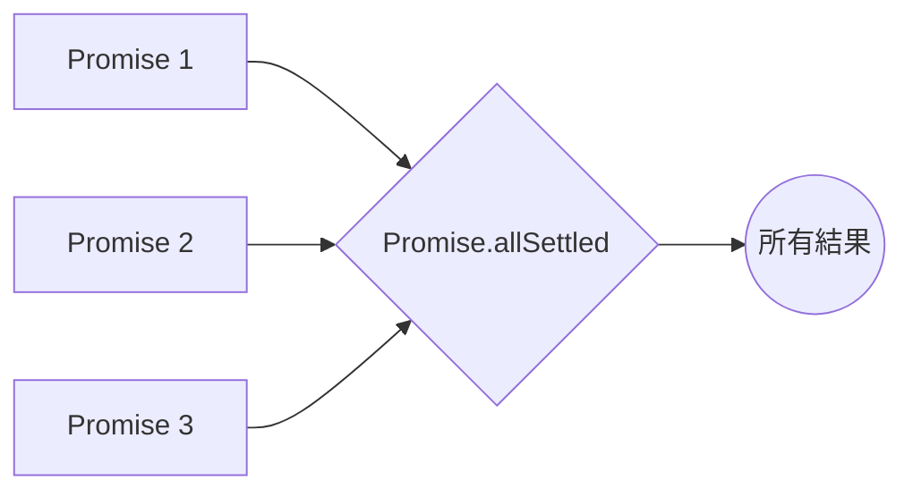
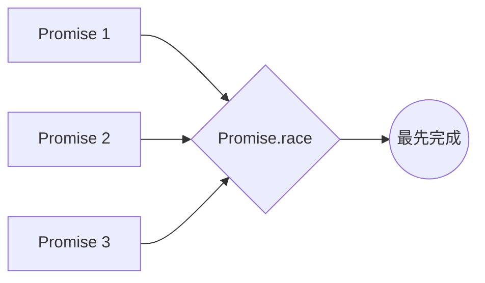
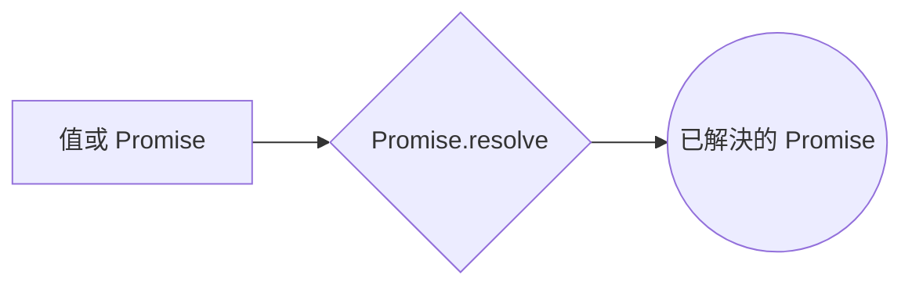
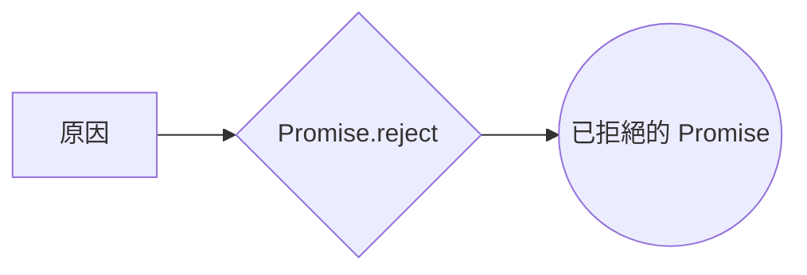

你的內容組織得很好，下面是將 `Promise.all` 和其他方法的比較部分整合在一起的版本：

---

## JavaScript 中的 Promise 方法詳解

### 摘要

`Promise.all` 是 JavaScript 中的一個方法，用於同時處理多個 Promise。它會等待所有 Promise 都完成後才會繼續執行下一步動作。如果其中任何一個 Promise 失敗，`Promise.all` 會立即返回錯誤並停止處理其他 Promise。

以下是使用 Mermaid 圖示來說明 `Promise.all` 的行為：



-   **說明:**
    -   `Promise.all` 接收一個包含多個 Promise 的可迭代對象（如陣列）。
    -   它會等待所有 Promise 都完成。如果所有 Promise 成功，`Promise.all` 會返回一個 resolved 的 Promise，其中包含所有 Promise 的結果。若任何一個 Promise 失敗，`Promise.all` 會立即返回一個 rejected 的 Promise，並包含該 Promise 的拒絕原因。

---

### 說明

想像你正在同時下載多個檔案。`Promise.all` 就像是一個下載管理器，它會同時監控所有檔案的下載進度。當所有檔案都下載完成後，`Promise.all` 會通知你並返回所有下載好的檔案。如果其中任何一個檔案下載失敗，`Promise.all` 會立即停止所有下載並告訴你哪個檔案出錯了。

### 主要功能

-   **Promise.all**: 接收一個包含多個 Promise 的可迭代對象（如陣列），當所有 Promise 都成功時，返回一個包含所有結果的 Promise。如果任何一個 Promise 失敗，返回的 Promise 會立即被拒絕，並返回第一个被拒绝的 Promise 的原因。

---

### 語法

```javascript
Promise.all(iterable)
```

-   `iterable`: 任何可迭代對象，例如 Array、Map、Set 等。可包含 Promise 或其他值（非 Promise 的值會被包裝成 Promise）。

---

### 返回結果

-   **所有 Promise 都成功**: 返回一個 resolved 的 Promise，包含所有結果的數組。
-   **任何一個 Promise 被 reject**: 返回一個 rejected 的 Promise，並包含第一个被拒绝的 Promise 的原因。

---

### `Promise.allSettled`



**說明:**

-   `Promise.allSettled` 等待所有 Promise 完成，返回每個 Promise 的狀態和結果。

---

### `Promise.race`



**說明:**

-   `Promise.race` 返回最先完成的 Promise 的結果。

---

### `Promise.resolve`



**說明:**

-   `Promise.resolve` 創建一個已解決的 Promise，包裝給定的值或另一個 Promise。

---

### `Promise.reject`



**說明:**

-   `Promise.reject` 創建一個已拒絕的 Promise，包裝給定的錯誤原因。

---

### 與其他方法的比較

-   **Promise.all**: 等待所有 Promise 成功才返回結果。如果任一 Promise 失敗，會立即拒絕。
-   **Promise.allSettled**: 等待所有 Promise 完成，返回每個 Promise 的最終狀態（成功或失敗）。適用於需要了解每個操作最終狀態的場景，例如批量任務處理。

-   **Promise.race**: 返回最先完成（無論是成功還是失敗）的 Promise 的結果。適用於需要快速獲取最先完成的結果時使用。

-   **Promise.resolve**: 創建一個已經 resolve 的 Promise。用於將一個值包裝成 Promise。

-   **Promise.reject**: 創建一個已經被 rejected 的 Promise。用於直接返回錯誤情況。

---

### 詞彙表

-   **Promise**: 代表一個非同步操作的最終結果，可能是成功（fulfilled）或失敗（rejected）。
-   **resolve**: 將 Promise 標記為成功完成，並傳遞結果值。
-   **reject**: 將 Promise 標記為失敗，並傳遞失敗原因。
-   **then**: 用於指定 resolve 和 reject 的回調函數。
-   **catch**: 用於處理 Promise 被 reject 的情況。
-   **可迭代對象**: 可以使用迴圈訪問其元素的對象，例如陣列、字串等。
-   **非同步操作**: 不會阻塞程式碼正常流程的操作，例如網路請求、計時器等。

---

### JavaScript Promise 方法應用場景

> 以下是 Promise.allSettled、Promise.race、Promise.resolve、Promise.reject 和 Promise.all 的應用場景：

-   Promise.all：當你需要等待多個非同步操作都完成後，才能繼續執行下一步操作時，可以使用 Promise.all [1-7]。
    -   例子：同時請求多個 API 接口，等所有接口都返回數據後再進行處理 [8-10]。
    -   注意：如果任何一個 Promise 被拒絕，Promise.all 會立即返回一個 rejected 的 Promise，並返回第一個被拒絕的原因 [2, 11-20]。
-   Promise.allSettled：當你需要知道每個 Promise 的最終狀態，無論成功或失敗時，可以使用 Promise.allSettled [21-25]。
    -   例子：批量任務處理，即使某些任務失敗，也希望知道所有任務的最終狀態 [23, 24]。
-   Promise.race：當你需要快速得到最先完成的 Promise 的結果時，可以使用 Promise.race [8, 22, 26-29]。
    -   例子：設置一個超時，如果超過一定時間 API 還沒返回數據，就取消請求。
-   Promise.resolve：當你需要一個已經 resolve 的 Promise 時，可以使用 Promise.resolve [22, 30-32]。
    -   例子：將一個同步操作包裝成 Promise。
-   Promise.reject：當你需要一個已經 rejected 的 Promise 時，可以使用 Promise.reject [22, 30, 33, 34]。
    -   例子：處理錯誤情況時，可以直接返回一個 rejected 的 Promise。

### 小測驗

1. **Promise.all 方法的主要功能是什麼？它接受什麼類型的輸入？**

    - **答案**: `Promise.all` 用於同時處理多個 Promise，並等待所有 Promise 都完成後返回結果。它接受一個可迭代對象（例如陣列），其中包含多個 Promise 或其他值（會自動包裝成 Promise）。

2. **Promise.all 返回的 Promise 在什麼情況下會被 resolve？**

    - **答案**: 當所有輸入的 Promise 都成功（即被 resolve）時，`Promise.all` 返回的 Promise 也會被 resolve。返回的 Promise 的結果是一個包含所有 Promise 成功結果的陣列，順序與輸入的 Promise 相同。

3. **如果 Promise.all 迭代的 Promise 中有一個被 rejected，會發生什麼？**

    - **答案**: 如果 `Promise.all` 迭代的任何一個 Promise 被 rejected，則 `Promise.all` 返回的 Promise 會立即被 rejected，並返回第一個被 rejected 的 Promise 的拒絕原因。

4. **Promise.all 方法的結果如何反映輸入 Promise 的順序？**

    - **答案**: `Promise.all` 返回的結果陣列中的每個元素，對應於輸入 Promise 陣列中相同位置的 Promise 結果。因此，結果陣列的順序與輸入的 Promise 陣列順序一致。

5. **Promise.all 適合用於哪些應用場景？請舉例說明。**

    - **答案**: `Promise.all` 適合用於需要等待所有異步操作都完成後才能繼續執行下一步操作的場景。例如，同時請求多個 API 接口，等所有接口都返回數據後再進行處理。

6. **Promise.allSettled 和 Promise.all 有什麼區別？它們分別適用於哪些場景？**

    - **答案**: `Promise.all` 要求所有 Promise 都成功才返回結果，而 `Promise.allSettled` 會等待所有 Promise 完成，不論成功或失敗，並返回每個 Promise 的最終狀態（成功或失敗）。`Promise.all` 適用於所有操作必須全部成功的場景，而 `Promise.allSettled` 適用於需要了解每個操作最終狀態的場景，例如批量任務處理。

7. **Promise.race 方法和 Promise.all 有什麼不同？**

    - **答案**: `Promise.race` 會返回最先完成（無論是成功還是失敗）的 Promise 的結果，而 `Promise.all` 需要等待所有 Promise 都完成後才會返回結果。`Promise.race` 適用於需要快速獲取最先完成的 Promise 的結果的場景。

8. **什麼時候會使用 Promise.resolve() 方法？**

    - **答案**: 當我們需要創建一個已經 resolve 的 Promise 時，可以使用 `Promise.resolve()` 方法。這通常用於將同步操作包裝成 Promise，或者當我們需要一個立即解決的 Promise 時使用。

9. **Promise.reject() 方法的用途是什麼？**

    - **答案**: `Promise.reject()` 方法用於創建一個已經被 rejected 的 Promise。這通常用於處理錯誤情況時，可以直接返回一個 rejected 的 Promise 來表示異常狀況。
