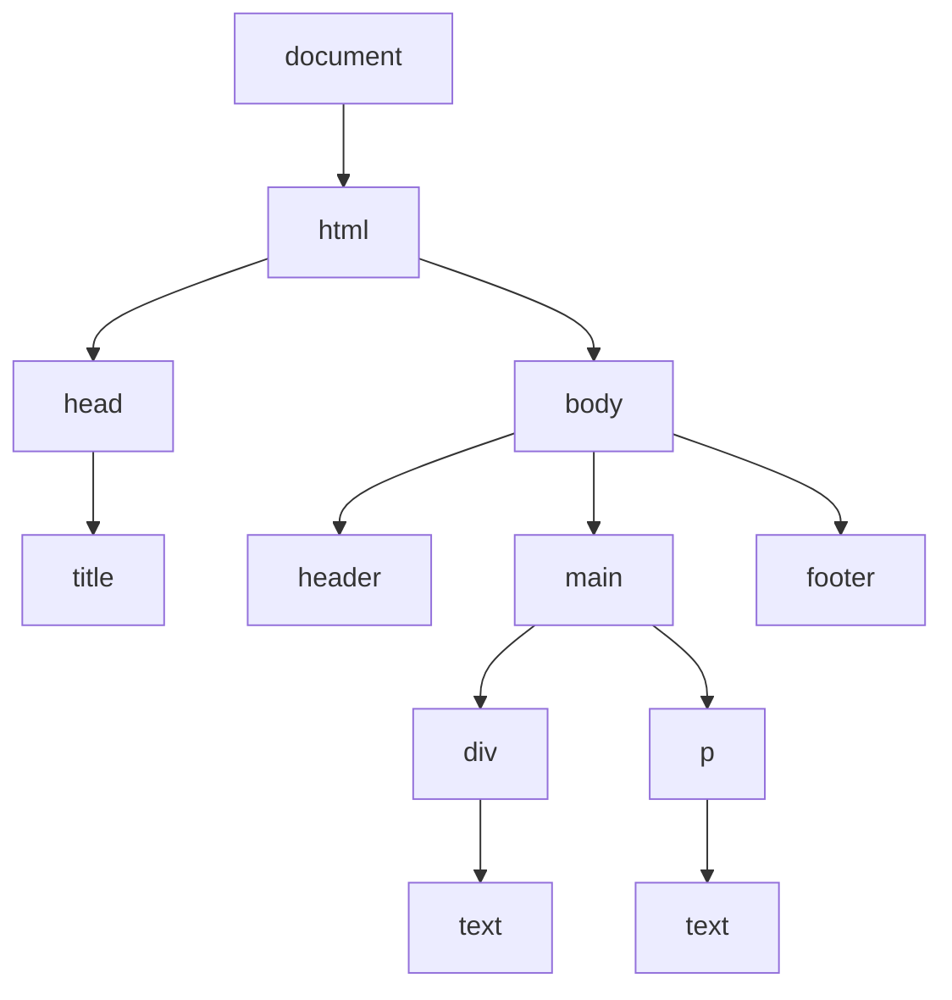
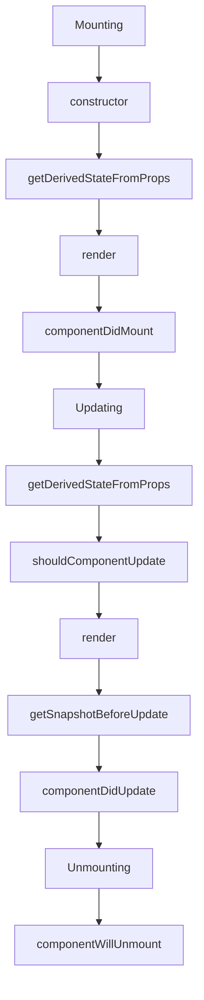
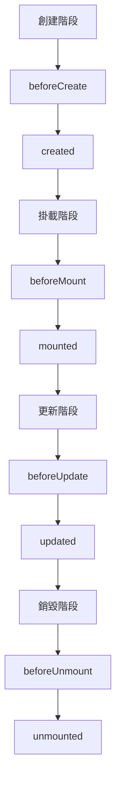
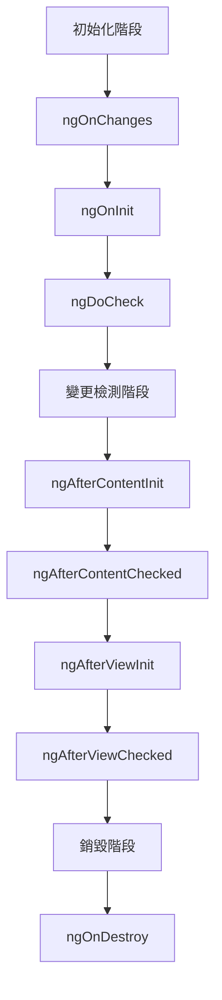

    > DOM (文件物件模型，Document Object Model) 是一種用於表示 HTML 和 XML 文件的編程介面。它將網頁的結構轉換為一個可以由程式碼操作的樹狀結構，使開發者能夠動態地訪問和修改網頁的內容、結構和樣式。以下是 DOM 的一些核心概念：

    1. **節點 (Node)**：DOM 中的每個部分（如元素、屬性、文字）都是一個節點。節點是 DOM 的基本組成單位。
    2. **元素 (Element)**：網頁中的標籤（如 `
`、`
`、`<a>` 等）在 DOM 中稱為元素節點。這些節點是最常見的 DOM 節點類型。
    3. **屬性 (Attribute)**：HTML 標籤的屬性（如 `id`、`class`、`src` 等）是屬性節點，屬於元素節點的一部分。
    4. **文本 (Text)**：文本節點包含在元素節點內的實際文字內容。
    5. **樹狀結構**：DOM 的結構是樹狀的，根節點通常是 `document`，它下面有各種子節點（如 `<html>`、`<body>` 等）。
    6. **操作 DOM**：可以使用 JavaScript 操作 DOM，常用的方法有 `getElementById`、`querySelector`、`createElement`、`appendChild` 等。這些方法允許動態地添加、移除或修改網頁內容。
    7. **事件**：DOM 也支持事件系統，開發者可以透過 JavaScript 綁定事件（如點擊、鍵盤輸入等），來響應使用者的行為。

DOM 是前端開發中非常重要的技術，因為它使網頁可以變得互動和動態。

以下是 DOM 的基本結構使用 Mermaid 來表示的圖表代碼，展示了 DOM 的樹狀結構：

這個圖表顯示了 DOM 的基本結構，從 `document` 節點開始，逐步展開到各種元素和文本節點。你可以將這段 Mermaid 代碼貼到支持 Mermaid 的編輯器中（如 Markdown 編輯器、一些 IDE 等），即可看到視覺化的 DOM 樹結構。

## node vs element

在 DOM 中，**節點 (Node)** 和 **元素 (Element)** 是兩個不同的概念，雖然它們經常被混用，但實際上有明顯的區別：

### 1. 節點 (Node)

-   **定義**：節點是 DOM 樹的基本單位，代表了網頁結構中的每一個組成部分。
-   **種類**：節點有多種類型，包括：
    -   **元素節點 (Element Node)**：如 `
`、`
` 等 HTML 標籤。
    -   **文本節點 (Text Node)**：元素內的文字內容。
    -   **屬性節點 (Attribute Node)**：元素的屬性，如 `id="example"`。
    -   **註解節點 (Comment Node)**：HTML 中的註解，如 `<!-- 這是註解 -->`。
-   **屬性**：節點的共同屬性包括 `nodeType`、`nodeName` 和 `nodeValue` 等。

### 2. 元素 (Element)

-   **定義**：元素是節點的一種類型，特指 HTML 或 XML 標籤，如 `
`、``、`<a>` 等。
-   **屬性**：元素節點特有屬性，如 `tagName`、`attributes`、`innerHTML`、`children` 等。
-   **作用**：元素節點是最常操作的節點類型，代表了頁面上的實際元素，可以包含其他元素節點、文本節點和屬性節點。

### 主要區別

-   **所有的元素都是節點，但不是所有的節點都是元素**。元素是節點中的一種。
-   節點包括多種類型（元素、文本、屬性、註解等），而元素僅指 HTML 或 XML 標籤。
-   節點是 DOM 結構的基礎構成，元素則是具體的標籤節點。

這樣的區分有助於理解 DOM 的整體結構和如何操作不同類型的節點。

## Real DOM 和 Virtual DOM

**Real DOM**（真實 DOM）和 **Virtual DOM**（虛擬 DOM）是前端開發中常見的兩種概念，它們在性能優化和 UI 更新方面有著重要的作用。以下是兩者的介紹及比較：

### Real DOM（真實 DOM）

1. **定義**：Real DOM 是指瀏覽器真正解析 HTML 文件後生成的 DOM 結構，它是一棵樹狀結構，代表了網頁的實際內容。
2. **特點**：

    - **慢速更新**：每次對 DOM 進行操作（如添加、刪除、修改節點），都會觸發瀏覽器的重繪（Repaint）或重排（Reflow），這些操作非常耗時。
    - **同步更新**：DOM 更新會立即影響頁面顯示，沒有緩衝機制。
    - **直接操作**：開發者直接操作真實的 DOM 結構，所有變更都會立刻生效。

3. **劣勢**：
    - 頻繁操作會導致性能問題，尤其是在大型、複雜的應用中。
    - 對 DOM 的改動需要經過瀏覽器的渲染引擎處理，會增加資源消耗。

### Virtual DOM（虛擬 DOM）

1. **定義**：Virtual DOM 是一種由 JavaScript 表示的虛擬節點樹結構，作為 Real DOM 的輕量級副本。它不會直接對頁面進行修改，而是將所有變更儲存在虛擬結構中。

2. **特點**：
    - **快速更新**：Virtual DOM 是輕量的，可以迅速地進行多次操作。
    - **異步批次更新**：所有變更會先在 Virtual DOM 中進行，然後以最佳化的方式一次性同步到 Real DOM。
    - **差異計算**：在更新 Virtual DOM 之後，React 等框架會進行差異計算（Diffing），找出變更的部分，然後有選擇地更新 Real DOM。
3. **優勢**：
    - 減少不必要的 DOM 操作，提升應用性能。
    - 簡化開發，讓開發者專注於狀態變更，而不需手動處理繁瑣的 DOM 操作。
    - 透過異步和批次處理，減少瀏覽器的重繪和重排次數。

### Real DOM vs Virtual DOM

| 特性     | Real DOM           | Virtual DOM                     |
| -------- | ------------------ | ------------------------------- |
| 更新速度 | 慢                 | 快                              |
| 操作方式 | 直接操作           | 通過 JavaScript 記錄變更        |
| 性能表現 | 頻繁操作會降低性能 | 高效，減少不必要的更新          |
| 異步處理 | 否                 | 是，批次更新                    |
| 應用場景 | 簡單、小型應用     | 複雜、大型應用（如 React、Vue） |

Virtual DOM 是現代前端框架（如 React、Vue）的核心技術之一，有助於提升應用的響應速度和用戶體驗。

## 最流行的前端三大框架：React、Vue 和 Angular 的比較

| 特性           | **React**                        | **Vue**                           | **Angular**                        |
| -------------- | -------------------------------- | --------------------------------- | ---------------------------------- |
| **開發者**     | Facebook                         | Evan You (個人開發，社群支持)     | Google                             |
| **初次發布**   | 2013 年                          | 2014 年                           | 2010 年                            |
| **語言**       | JavaScript、JSX                  | JavaScript、TypeScript、HTML 模板 | TypeScript                         |
| **架構類型**   | Library（函式庫）                | Framework + Library               | Framework（框架）                  |
| **學習曲線**   | 中等                             | 低                                | 高                                 |
| **核心特性**   | Virtual DOM、組件化、單向資料流  | Virtual DOM、雙向綁定、組件化     | 雙向資料綁定、依賴注入、模組化     |
| **數據流向**   | 單向資料流                       | 單向與雙向綁定選擇                | 雙向資料流                         |
| **性能**       | 快速且高效                       | 更快的渲染效能                    | 高效，但較大項目可能更耗資源       |
| **生態系統**   | 巨大、豐富的社群及第三方庫       | 較成熟、易於使用的插件系統        | 完整、強大的內建工具和模組         |
| **適合項目**   | SPAs、互動式應用、小型到大型應用 | 小型應用、互動性網站、快速原型    | 企業級應用、大型系統               |
| **路由**       | React Router                     | Vue Router                        | 內建 Angular Router                |
| **狀態管理**   | Redux、MobX、Context API         | Vuex、Pinia                       | RxJS、NgRx                         |
| **開發體驗**   | 高度自定義的組件和工具鏈         | 簡潔直觀、優秀的開發體驗          | 複雜但功能強大                     |
| **社群與支持** | 強大的社群支持與資源             | 友好的社群、良好的文檔支持        | 穩定的企業支持和長期更新           |
| **擴展性**     | 容易與其他技術（如 Next.js）整合 | 易於集成其他庫和工具              | 內建完整解決方案，較難整合外部技術 |
| **文件編寫**   | JSX 需要學習一些新語法           | 可用 HTML 模板，容易上手          | HTML 和 TypeScript，代碼較冗長     |

### 總結

-   **React**：靈活、可擴展，適合需要高度自定義的應用。學習 JSX 可能有些挑戰，但社群和生態系統非常強大。
-   **Vue**：學習曲線低且易於使用，適合快速開發。具有輕量、簡潔的優勢，非常適合小型到中型項目。
-   **Angular**：全面而強大，但學習曲線較高。適合大型企業級應用，提供完整的開發解決方案。

這些框架各有優勢，選擇合適的框架應根據項目需求、團隊技能和開發目標來決定。

## 那 React 生命週期

React 生命週期（Lifecycle）是指 React 組件在其存在期間經歷的不同階段。每個階段都有特定的生命週期方法，允許開發者在這些階段執行代碼。React 組件的生命週期可以分為以下三個主要階段：**掛載（Mounting）**、**更新（Updating）**、和 **卸載（Unmounting）**。以下是詳細的說明：

### 1. 掛載階段 (Mounting)

這個階段是組件被創建並插入到 DOM 中的過程。

-   **`constructor`**：初始化組件的狀態 (state) 和綁定方法。這是生命週期的起始點。
-   **`static getDerivedStateFromProps(props, state)`**：根據傳入的 props 更新 state，在每次 render 前執行。用於同步 state 與 props。
-   **`render`**：渲染組件的 UI，返回要顯示的 JSX 結構。這是唯一必須實現的方法。
-   **`componentDidMount`**：組件已經被渲染到 DOM 後執行，適合執行 API 請求、訂閱等副作用操作。

### 2. 更新階段 (Updating)

這個階段發生在組件的狀態或屬性改變時，導致重新渲染。

-   **`static getDerivedStateFromProps(props, state)`**：同掛載階段，用於在 props 變更時更新 state。
-   **`shouldComponentUpdate(nextProps, nextState)`**：決定組件是否需要重新渲染，返回 `true` 或 `false`。用於性能優化。
-   **`render`**：重新渲染 UI，根據最新的 state 和 props。
-   **`getSnapshotBeforeUpdate(prevProps, prevState)`**：在真實 DOM 更新前調用，用於獲取更新前的 DOM 狀態（如滾動位置）。
-   **`componentDidUpdate(prevProps, prevState, snapshot)`**：組件更新完成並重新渲染到 DOM 後調用，用於操作更新後的 DOM 或處理副作用。

### 3. 卸載階段 (Unmounting)

這個階段是組件被從 DOM 中移除的過程。

-   **`componentWillUnmount`**：組件從 DOM 中移除前執行，適合清理副作用（如取消訂閱、清除計時器）。

### 生命週期方法總覽圖表

### 注意事項

-   **新生命週期方法**：隨著 React 16.3+ 的推出，某些過時的生命周期方法（如 `componentWillMount`、`componentWillUpdate`、`componentWillReceiveProps`）已被棄用，並用新方法取代。
-   **Hooks**：在 React 函數組件中，生命週期方法被 `useEffect` 等 Hooks 所取代，這使得管理副作用更直觀和簡潔。

透過理解這些生命週期方法，可以更好地控制組件的行為和優化性能，特別是在大型應用中。

## vue 生命週期

Vue 的生命週期是指 Vue 組件在其存在期間的不同階段，每個階段都有對應的生命週期鉤子函數，可以在組件初始化、渲染、更新和銷毀時執行自定義邏輯。Vue 組件的生命週期主要分為：**創建階段（Creation）**、**掛載階段（Mounting）**、**更新階段（Updating）** 和 **銷毀階段（Unmounting）**。以下是 Vue 生命週期的詳細說明：

### Vue 生命週期總覽

### 1. 創建階段 (Creation)

這個階段是組件被實例化但尚未掛載到 DOM 上的過程。組件的資料、方法等被初始化，但還未渲染。

-   **`beforeCreate`**：組件實例被創建之前執行，`data` 和 `methods` 等屬性還未初始化。
-   **`created`**：組件實例創建完成，`data`、`methods` 已初始化，適合執行初始數據的設置或 API 請求，但組件還未掛載到 DOM 上。

### 2. 掛載階段 (Mounting)

這個階段是組件已經被創建並將渲染結果插入到 DOM 中的過程。

-   **`beforeMount`**：組件即將掛載到 DOM 之前執行，此時模板已經編譯成渲染函數，但尚未渲染到頁面。
-   **`mounted`**：組件已經被掛載到 DOM 上執行，適合進行 DOM 操作、第三方庫初始化。

### 3. 更新階段 (Updating)

這個階段發生在組件的狀態（`data`、`props` 等）改變，並觸發重新渲染的過程。

-   **`beforeUpdate`**：組件的響應式數據改變，組件即將更新和重新渲染到 DOM 上時執行，適合在更新前獲取或操作數據。
-   **`updated`**：組件更新完成並重新渲染到 DOM 上後執行，可用於 DOM 操作，但應避免在此鉤子中進行過多的狀態更新以避免無限循環。

### 4. 銷毀階段 (Unmounting)

這個階段是組件即將被從 DOM 中移除的過程。

-   **`beforeUnmount`**：組件即將被銷毀之前執行，適合進行清理工作，如取消事件監聽、清除計時器等。
-   **`unmounted`**：組件已經從 DOM 中被銷毀後執行，所有的數據綁定和事件監聽已被解除。

### 使用注意

-   **生命週期鉤子的應用**：不同階段的鉤子可以用來處理各種初始化、渲染、更新和清理操作。
-   **避免不必要的狀態改變**：在 `updated` 中應謹慎使用狀態更新，避免無限重渲染。

### 總結

Vue 的生命週期提供了對組件行為的完整控制，透過適當使用這些鉤子函數，開發者可以優化組件性能、處理副作用並維持應用邏輯的整潔。

## Angular 生命週期

Angular 的生命週期是指 Angular 組件在其存在期間經歷的各種階段，每個階段都有對應的生命週期鉤子方法，這些方法允許開發者在組件的創建、更新和銷毀過程中插入自定義邏輯。Angular 組件的生命週期主要分為 **初始化階段（Initialization）**、**變更檢測階段（Change Detection）** 和 **銷毀階段（Destruction）**。以下是各個階段和鉤子方法的詳細說明：

### Angular 生命週期總覽

### 1. 初始化階段 (Initialization)

這個階段是組件被創建並初始化的過程。組件的輸入屬性被設置，且初始化邏輯被執行。

-   **`ngOnChanges(changes: SimpleChanges)`**：當 Angular 檢測到輸入屬性（`@Input`）的變化時會調用這個方法。它會在 `ngOnInit()` 之前並在每次屬性變更時執行。
-   **`ngOnInit()`**：在 Angular 第一次顯示數據綁定後立即執行，這是組件的初始化階段，適合執行組件的初始邏輯，如 API 請求或設置初始狀態。

-   **`ngDoCheck()`**：用於自定義變更檢測的檢查。這個方法在每次 Angular 進行變更檢測時調用，適合進行更精細的變更監測。

### 2. 變更檢測階段 (Change Detection)

這個階段負責檢測和處理組件內容（投影內容）和視圖的變更。

-   **`ngAfterContentInit()`**：當 Angular 投影（`ng-content`）的內容初始化完成後調用，只在內容初始化後執行一次。

-   **`ngAfterContentChecked()`**：每次 Angular 檢測到內容變更後執行。這個方法會在 `ngAfterContentInit()` 之後並且在每次內容檢查後執行。

-   **`ngAfterViewInit()`**：當組件的視圖（包括子組件）初始化完成後調用，適合進行與視圖相關的初始化操作。

-   **`ngAfterViewChecked()`**：每次 Angular 檢測到視圖變更後執行。這個方法會在 `ngAfterViewInit()` 之後並且在每次檢查視圖後執行。

### 3. 銷毀階段 (Destruction)

這個階段是組件即將被銷毀並從 DOM 中移除的過程。

-   **`ngOnDestroy()`**：在組件被銷毀之前執行，適合進行清理工作，例如取消訂閱、釋放資源、清除計時器等。

### 使用注意

-   **變更檢測**：Angular 的變更檢測機制非常強大，但應避免在 `ngAfterViewChecked()` 和 `ngDoCheck()` 等頻繁調用的方法中執行耗時操作，否則會影響性能。
-   **內存管理**：確保在 `ngOnDestroy()` 中適當清理資源以避免內存洩漏，尤其是事件監聽和訂閱的清理。

### 總結

Angular 透過這些生命週期鉤子方法，開發者能精細控制組件在各階段的行為。理解和正確使用這些鉤子，可以讓組件更加高效、可靠，同時保持代碼的結構清晰和可維護性。

## 三大框架 的 生命週期 比較

以下是 React、Vue 和 Angular 三大框架的生命週期方法比較表，將各自的生命週期方法對應排列，幫助理解不同框架在組件創建、更新和銷毀過程中的異同：

| **階段**   | **React**                      | **Vue**             | **Angular**                         |
| ---------- | ------------------------------ | ------------------- | ----------------------------------- |
| **初始化** | - `constructor()`              | - `beforeCreate()`  | - `ngOnChanges()`（輸入屬性改變時） |
|            | - `getDerivedStateFromProps()` | - `created()`       | - `ngOnInit()`                      |
|            |                                |                     | - `ngDoCheck()`                     |
| **掛載**   | - `render()`                   | - `beforeMount()`   |                                     |
|            | - `componentDidMount()`        | - `mounted()`       |                                     |
| **更新**   | - `getDerivedStateFromProps()` | - `beforeUpdate()`  | - `ngOnChanges()`（輸入屬性改變時） |
|            | - `shouldComponentUpdate()`    | - `updated()`       | - `ngDoCheck()`                     |
|            | - `render()`                   |                     | - `ngAfterContentInit()`            |
|            | - `getSnapshotBeforeUpdate()`  |                     | - `ngAfterContentChecked()`         |
|            | - `componentDidUpdate()`       |                     | - `ngAfterViewInit()`               |
|            |                                |                     | - `ngAfterViewChecked()`            |
| **銷毀**   |                                | - `beforeUnmount()` | - `ngOnDestroy()`                   |
|            | - `componentWillUnmount()`     | - `unmounted()`     |                                     |

### 詳細對比

1. **初始化階段**

    - **React**: 主要透過 `constructor` 和 `getDerivedStateFromProps` 來初始化狀態和屬性。
    - **Vue**: 創建階段有 `beforeCreate` 和 `created`，適合初始數據設定和 API 請求。
    - **Angular**: 使用 `ngOnChanges`、`ngOnInit` 和 `ngDoCheck` 進行初始化和變更檢測。

2. **掛載階段**

    - **React**: 掛載完成後執行 `componentDidMount`，常用於執行副作用操作。
    - **Vue**: 掛載前後分別有 `beforeMount` 和 `mounted`，適合操作 DOM 或初始化插件。
    - **Angular**: 沒有專門的掛載鉤子，而是透過其他初始化方法實現。

3. **更新階段**

    - **React**: 透過一系列的更新方法，如 `shouldComponentUpdate` 來控制是否更新，`componentDidUpdate` 在更新完成後執行。
    - **Vue**: 更新階段有 `beforeUpdate` 和 `updated`，用於檢查和處理變更。
    - **Angular**: 更新階段的方法涵蓋內容和視圖的檢查，包含 `ngAfterContentChecked` 和 `ngAfterViewChecked` 等多個方法。

4. **銷毀階段**
    - **React**: 使用 `componentWillUnmount` 清理組件相關的資源和副作用。
    - **Vue**: `beforeUnmount` 和 `unmounted` 用於組件移除前後的清理工作。
    - **Angular**: 使用 `ngOnDestroy` 進行銷毀前的清理工作，如取消訂閱。

這張表格可以幫助你更好地理解和比較三大框架的生命週期，根據項目需求選擇合適的框架，並有效管理組件的行為。

以下是 React、Vue 和 Angular 三大框架的市佔率比較表格：

| **框架**    | **市佔率** | **主要優勢**                                                 | **主要應用領域**                            |
| ----------- | ---------- | ------------------------------------------------------------ | ------------------------------------------- |
| **React**   | 40%-50%    | 強大的社群支持和生態系統、靈活的組件化設計、Virtual DOM 技術 | 互動式網站、SPA（單頁應用）、大規模企業應用 |
| **Vue**     | 約 20%     | 低學習曲線、易於上手、靈活性高、性能優化                     | 中小型企業應用、快速原型、前端獨立項目      |
| **Angular** | 約 15%-20% | 完整的框架、TypeScript 支持、適合大型和複雜的企業級應用      | 企業級應用、數據驅動的複雜項目              |

### 市佔率趨勢與未來展望

| **框架**    | **未來展望**                                                                                              |
| ----------- | --------------------------------------------------------------------------------------------------------- |
| **React**   | 可能持續增長，因其強大的社群和生態系統，適用於各種規模的應用，特別是全端開發。                            |
| **Vue**     | 預計會繼續增長，特別是在亞洲市場和初創企業中，Vue 3 的性能優化和組件 API 使其在大型項目中也越來越受青睞。 |
| **Angular** | 專注於優化開發體驗和增強性能，以挽回市場份額，仍是許多企業級應用的首選。                                  |
