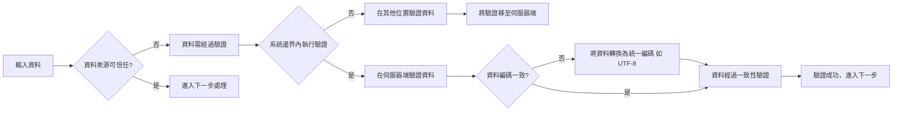

是計算機科學和計算機安全的詞語，是指程式資料或是執行的程式改變其「信任」程度的邊界，或是二個不同能力的系統交換資料或是指令地方。像某一個應用程式獲得了較高的特權(例如超級用戶)，就是一個程式信任邊界的例子。資料信任邊界是指資料從不可信任來源(例如網路插座或是使用者輸入) 進入系統的位置。

信任邊界違規(trust boundary violation) 是指軟體所收到的資料再進入邊界前沒有被驗證，但軟體信任該資料的漏洞。

1. 研發人員應定義信任邊界
    1. 邊界以內系統本身可控制之範圍
    2. 邊界以外不受控制之範圍
2. 以網頁程式碼為例，若部分程式碼於伺服器端執行( PHP / Python / Java / Node.js )
    1. 於伺服器端執行之程式碼可受系統控制
    2. 但於用戶端執行之程式碼則不受控制。

> 只要放在 server 都算相對安全的例如 SSR，從伺服器端將HTML 做好再轉到前端畫面都算安全再Client 端呈現就是不可信任的

## 主要特徵

1. 內部網路 vs. 外部網路
    1. 內部網路 : 被認為是安全的區域，內部用戶和系統之間的通信被默認認為是可信的。
    2. 外部網路 : 被認為是不安全的區域，任何來自外部的通信都需要經過嚴格的驗證和過濾。
2. 防火牆和安全設備 : 
    1. 再信任的系統邊界的訪問請求，會有嚴格的訪問控制措施，比如用戶認證、授權和審計。
3. VPN和遠程訪問 : 
    1. 對於需要遠程訪問內部網路的用戶，會通過虛擬專用網路(VPN) 等技術來建立一個安全的通信通道，從而將外部用戶"引入”信任的系統邊界內。

### 局限性

1. 模糊的邊界 : 
    1. 隨著雲計算、移動辦公室聯網的發展，網路邊界變得越來越模糊，使得信任的系統邊界難以明確
2. 內部威脅 : 
    1. 假設內部網路是完全可信的忽視了內部威脅( 如內部員工的惡意行為或無意的安全漏洞 )
3. 動態環境 : 
    1. 現代網路環境是動態和變化的，傳統的信任邊界無法快速變化的網路拓撲和威脅形勢。

### 零信任模型的優勢

零信任安全模型 ( Zero Trust Security ) 正是為了解信任的系統邊界概念的局限性而提出的。零信任模型不再依賴于明確的網路邊界，而是對所有訪問請求都進行持續的驗證和授權，不論請求來自內部還是外部。通過這種方式，零信任模型能夠更好地適應網路環境，提高整體的安全性。

零信任安全的核心理念是”不信任任何人，始終進行驗證”，即不論是內部還是外部的用戶和設備，都必續再每次訪問資訊時進行驗證和授權。零信任安全模型的主要原則包括 : 

1. 最小權限訪問 : 
    1. 用戶和設備只被授權完成其工作所需的最低權限，從而減少替再的安全風險。
2. 持續驗證 : 
    1. 每次訪問請求都要進行驗證，確保身分的合法性和訪問請求的合理性。
3. 細粒度訪問控制 : 
    1. 通過細化的訪問控制策略，確保用戶只能訪問其授權的資源。
4. 端到端加密 :
    1. 確保數據再傳輸過程的安全，通過月戶只能訪問其授權的資源。
5. 假受入侵 : 
    1. 假設系統已經被入侵，通過持續監控和快速響應來檢測和應對威脅。

### 零信任安全模型的實施通常包括以下步驟 :

1. 明確關鍵資源和數據 : 
    1. 需要保護的關鍵資源和數據，明確其訪問控制策略。
2. 用戶和設備身分管理 : 
    1. 使用多因素認證 ( MFA ) 等技術，確保用戶和設備的身分驗證。
3. 實施訪問控制策略 : 
    1. 根據用戶和設備的身分、位置、狀態等信息，動態調整訪問控制策略。
4. 持續監控和分析 
    1. 通過監控和分析網路活動，及時發現和響應異常行為和淺再威脅。
5. 建立信任評估機制
    1. 持續評估用戶和設備的信任狀態，根據評估結果調整訪問權限。

---

### 信任之系統邊界我們來探討 網路、程式、伺服器在不同層面的保護措施來確保整體系統的安全性。

#### 1. 網路邊界
- 事件比喻：你在舉辦一個大型公開活動，如音樂會，會場設有多重保安檢查。
- 防火牆：相當於活動入口處的保安門。只有持有有效票證的人才能進入，這樣可以防止未經授權的人進入會場。
- 入侵檢測系統（IDS）：像是場內的保安人員，會注意到任何異常的行為（如有人試圖攀越圍欄）並及時採取行動。
- 加密：就像是在舞台上的演唱內容僅對觀眾可見，即使有人試圖錄音或拍攝，也無法清楚捕捉到音樂的真實內容（音訊保護）。

#### 2. 程式邊界
- 事件比喻：你正在參加一個私人派對，主辦方在門口進行了多層次的檢查。
- 漏洞管理：就像是派對主辦方定期檢查門禁系統，修補任何可能的安全漏洞，例如門鎖不牢或警報系統失效。
- 代碼審查：類似於派對主辦方仔細檢查每位賓客的身份證明和邀請函，確保每個人都是受邀的，防止假冒者混入。
- 數據處理：如同派對主辦方對賓客的信息進行準確記錄，以便在必要時核對身份，避免錯誤的賓客進入特定區域。

#### 3. 伺服器邊界
- 事件比喻：想像你正在參觀一個高級私密展覽，展覽館的每個區域都有不同的安全措施。
- 補丁管理：就像展覽館定期檢查和更新其安全設施，確保門禁系統和警報裝置處於良好工作狀態，防止任何可能的安全漏洞。
- 數據加密：相當於展覽館使用透明的防護罩來保護展示品，即使有人試圖接近，也無法直接接觸或損壞展品（數據）。
- 監控與日志：就像展覽館安裝了多個監控攝像頭來記錄參觀者的行為，並保持詳細的訪客登記簿，以便在需要時查閱。

---

### 總結

信任之系統邊界在現代計算機科學和安全領域中起著至關重要的作用。它們定義了系統中哪些部分是可以信任的，哪些部分是需要進行嚴格檢查的。在網路、程式和伺服器的不同層面，各自存在著不同的挑戰和防護措施：

1. **網路邊界**：利用防火牆、入侵檢測系統和加密技術來防止未經授權的訪問和保護數據傳輸。

2. **程式邊界**：通過漏洞管理、代碼審查和數據處理來確保程式的安全性，避免潛在的安全風險。

3. **伺服器邊界**：包括補丁管理、數據加密和監控與日志管理，確保伺服器的安全和數據的完整性。

這些邊界的設計和管理直接影響到整體系統的安全性。然而，隨著網路環境的動態變化和內部威脅的增加，傳統的信任邊界正面臨挑戰。因此，零信任安全模型應運而生，通過對所有訪問請求進行持續的驗證和授權，不再依賴於固定的邊界，從而適應現代網路環境的需求。

---

這樣的總結能幫助讀者快速理解文章的核心內容，並強調信任系統邊界和零信任安全模型的重要性。