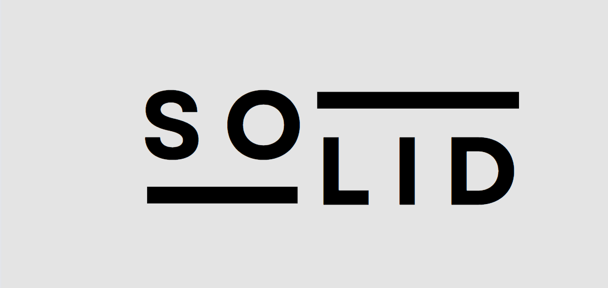

在寫程式時，我們應該專注於解決當前的問題，而不是僅僅為了寫程式而寫程式。若我們過於追求完美的設計，結果卻是在客戶需要時，為了增加新的邏輯而感到非常困惑和崩潰。

### 遵循 SOLID 原則能夠幫助我們：

1. **增強程式碼的可維護性**：當需求變更時，我們能夠更輕鬆地修改程式碼，而不會影響到其他部分。
2. **提升系統的可擴展性**：在未來添加新功能時，遵循 SOLID 原則可以減少出現錯誤的風險。
3. **降低程式碼的複雜度**：通過分離不同的職責，我們可以保持程式碼的清晰和簡潔。

> 簡而言之，SOLID 原則提供了一套設計指導方針，使我們能夠撰寫更可靠、可維護和易於擴展的程式碼，從而減少在應對需求變更時的壓力。

--- 

### SOLID 是五大物件導向設計原則的簡稱，分別為：

1. **[單一職責原則 (Single Responsibility Principle, SRP)](/docs/你前端該知道的一些事/設計原則/SOLID%20原則：單一職責原則)**：每個類別應該只有一個職責，並且只有一個引起變更的原因。

2. **[開放/封閉原則 (Open/Closed Principle, OCP)](/docs/你前端該知道的一些事/設計原則/SOLID%20原則：開放封閉原則)**：軟體應該對擴展開放，對修改封閉。也就是說，應該能夠通過新增程式碼來擴展功能，而不需要修改現有的程式碼。

3. **[里氏替換原則 (Liskov Substitution Principle, LSP)](/docs/你前端該知道的一些事/設計原則/SOLID%20原則：里氏替換原則)**：子類應該可以替換父類，而不會導致程式行為的不正確。也就是說，使用父類的地方應該可以安全地使用子類。

4. **[介面隔離原則 (Interface Segregation Principle, ISP)](/docs/你前端該知道的一些事/設計原則/SOLID%20原則：介面隔離原則)**：應該為每個特定的功能提供專用的介面，而不是為多個功能提供單一通用介面。這樣可以避免不必要的依賴。

5. **[依賴反轉原則 (Dependency Inversion Principle, DIP)](/docs/你前端該知道的一些事/設計原則/SOLID%20原則：依賴反轉原則)**：高層模組不應依賴低層模組，兩者應依賴於抽象介面。這樣可以降低模組之間的耦合性，增強系統的靈活性。

[參考](https://hackmd.io/@Aquamay/H1dzRpZ7a?utm_source=preview-mode&utm_medium=rec)