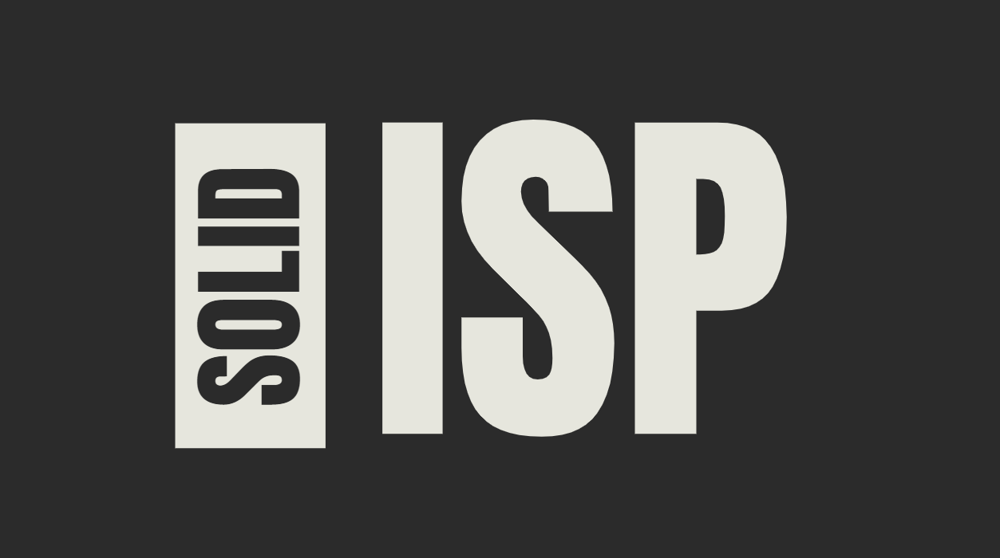

不要讓使用者被迫依賴於他們不需要的功能。就像你不需要為所有功能付費或擔心不需要的功能一樣，設計良好的介面應該只包含相關的方法，使得使用者可以專注於他們真正需要的功能。



**介面隔離原則**（Interface Segregation Principle, ISP）是 SOLID 原則中的第四個原則。這個原則的核心思想是：

- **客戶端不應該被迫依賴於它們不使用的方法。**

換句話說，介面應該被設計為小而專一的，這樣使用者只需要關注它們所需的功能，而不是整個介面的所有方法。這樣可以提高系統的靈活性和可維護性。

### 定義

介面隔離原則的具體定義是：
- 一個類別應該只依賴於它實際需要的介面，而不是依賴於它不需要的介面。

### 理論背景

這個原則的目的是減少不必要的依賴，從而減少變更的影響範圍。當介面過於龐大且包含多個不相關的方法時，任何對該介面的修改都可能影響到所有使用該介面的類別。遵循介面隔離原則可以使每個介面只包含與其相關的方法，從而降低對其他類別的影響。

### 範例

以下是使用 TypeScript 的範例，展示如何遵循和違反介面隔離原則：

#### **不符合 ISP 的設計**

```typescript
interface Worker {
    work(): void;
    eat(): void;
}

class HumanWorker implements Worker {
    work(): void {
        console.log('Working...');
    }
    
    eat(): void {
        console.log('Eating...');
    }
}

class RobotWorker implements Worker {
    work(): void {
        console.log('Working...');
    }
    
    eat(): void {
        // Robots don't eat, so this method is not applicable
        throw new Error('Robots do not eat.');
    }
}
```

在這個範例中，`Worker` 介面包含了 `work` 和 `eat` 兩個方法，這會導致 `RobotWorker` 類別必須實現 `eat` 方法，儘管這個方法對於機器人來說並不適用。這違反了介面隔離原則，因為 `RobotWorker` 被迫依賴於它不需要的方法。

#### **符合 ISP 的設計**

```typescript
interface Workable {
    work(): void;
}

interface Eatable {
    eat(): void;
}

class HumanWorker implements Workable, Eatable {
    work(): void {
        console.log('Working...');
    }
    
    eat(): void {
        console.log('Eating...');
    }
}

class RobotWorker implements Workable {
    work(): void {
        console.log('Working...');
    }
}
```

在這個改進的設計中，我們將 `Worker` 介面拆分為 `Workable` 和 `Eatable` 兩個專一的介面。`HumanWorker` 類別實現了這兩個介面，而 `RobotWorker` 類別只實現了 `Workable` 介面。這樣每個類別只依賴於它實際需要的介面，符合介面隔離原則。

> 介面隔離原則（ISP）鼓勵將介面設計為小而專一的，使得每個介面只包含相關的方法。這樣可以減少類別對於不需要的方法的依賴，提高系統的靈活性和可維護性。在設計介面時，遵循介面隔離原則有助於降低系統的複雜性，使得變更對其他部分的影響最小化。


