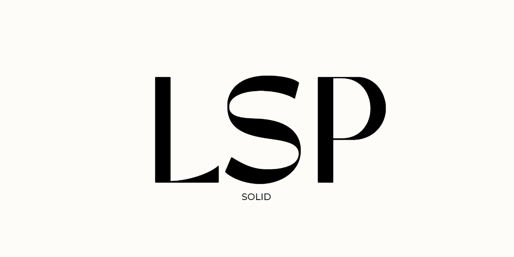

在 TypeScript 中應用里氏替換原則（Liskov Substitution Principle, LSP）可以幫助你設計出更可靠且可擴展的類別系統。TypeScript 的靜態類型檢查功能有助於確保子類別對象可以正確替代父類別對象，並符合里氏替換原則。



在 TypeScript 中應用**里氏替換原則**（Liskov Substitution Principle, LSP）可以幫助你設計出更可靠且可擴展的類別系統。TypeScript 的靜態類型檢查功能有助於確保子類別對象可以正確替代父類別對象，並符合里氏替換原則。

### TypeScript 中的里氏替換原則範例

#### 1. **不符合 LSP 的設計**

```typescript
class Bird {
    fly(): void {
        console.log('Flying');
    }
}

class Penguin extends Bird {
    // Penguin 不支持 fly 方法
    fly(): void {
        throw new Error('Penguins cannot fly!');
    }
}

function makeBirdFly(bird: Bird): void {
    bird.fly();
}

// 使用
const penguin = new Penguin();
makeBirdFly(penguin);  // 這會引發錯誤
```

在這個範例中，`Penguin` 類別繼承自 `Bird` 類別，但 `Penguin` 的 `fly` 方法不符合預期行為，這違反了里氏替換原則。`Penguin` 不應該用於需要 `fly` 方法的地方，因為它無法正確執行這個方法。

#### 2. **符合 LSP 的設計**

```typescript
class Bird {
    fly(): void {
        console.log('Flying');
    }
}

class Sparrow extends Bird {
    // 正常繼承並實現 fly 方法
}

class Ostrich extends Bird {
    fly(): void {
        // 這裡可以選擇不實現 fly 方法，或者提供一個合理的實現
        console.log('Ostriches cannot fly.');
    }
}

function makeBirdFly(bird: Bird): void {
    bird.fly();
}

// 使用
const sparrow = new Sparrow();
makeBirdFly(sparrow);  // 正常飛行

const ostrich = new Ostrich();
makeBirdFly(ostrich);  // 可以用空實現，並不會崩潰
```

在這個範例中，`Sparrow` 和 `Ostrich` 類別都繼承自 `Bird` 類別，並提供了合理的 `fly` 方法實現。即使 `Ostrich` 的 `fly` 方法做了一些無操作的實現，但它仍然符合里氏替換原則，因為它可以被用於需要 `Bird` 對象的地方，而不會引發錯誤。

### 更複雜的範例：使用 TypeScript 接口

在 TypeScript 中，接口（interfaces）也是一種實現里氏替換原則的有效方式。

```typescript
interface Shape {
    area(): number;
}

class Rectangle implements Shape {
    constructor(private width: number, private height: number) {}

    area(): number {
        return this.width * this.height;
    }
}

class Square extends Rectangle {
    constructor(side: number) {
        super(side, side);
    }
}

function printArea(shape: Shape): void {
    console.log(`Area: ${shape.area()}`);
}

// 使用
const rectangle = new Rectangle(4, 5);
printArea(rectangle);  // Area: 20

const square = new Square(4);
printArea(square);     // Area: 16
```

在這個範例中，`Rectangle` 類別和 `Square` 類別都實現了 `Shape` 接口，並且 `Square` 繼承自 `Rectangle`，但使用了相同的邊長來創建正方形。這符合里氏替換原則，因為 `Square` 可以用於 `Shape` 類型的任何地方，並且 `area` 方法會正確地返回面積。

### 總結

在 TypeScript 中，里氏替換原則可以幫助確保子類別對象可以替代父類別對象而不改變程式的正確性。利用 TypeScript 的靜態類型檢查功能，你可以設計出符合這個原則的類別系統，從而提高代碼的可靠性和可維護性。遵循里氏替換原則有助於設計更靈活、可擴展且易於維護的應用程式。