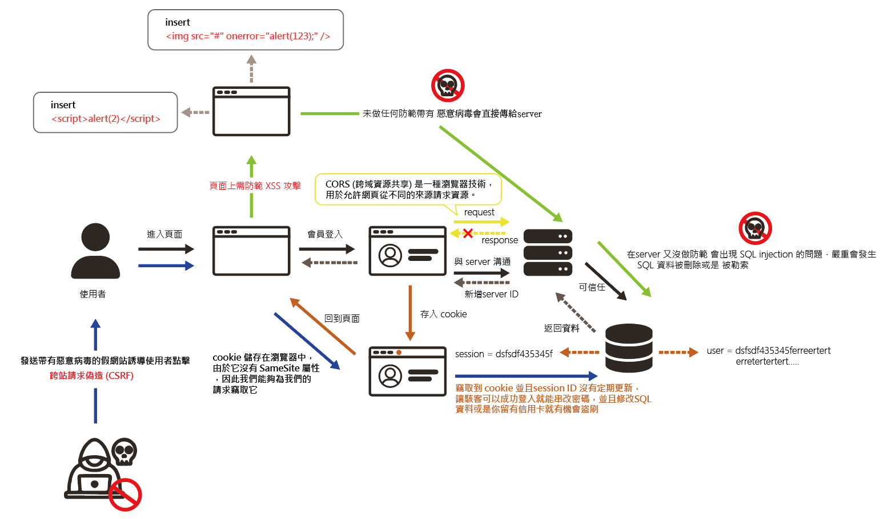

## 進入一個網頁後，與後端安全且有效地溝通是一個重要的課題

> 特別是在處理敏感數據或進行交易時

### 下方圖示是網路安全知識不足的狀況下，進入有機會發生的事件

**首先使用者進入網頁在非常順利的情況下，就能安全進入會員登入並返回到原本的頁面，那不順利的時候又會發生甚麼 ?**

1. [CSRF 跨站請求偽造](/docs/你前端該知道的一些事/資訊安全/你知道CSRF%20跨站請求偽造)
2. CORS 跨站資源共享
3. XSS 攻擊
4. SQL Injection
5. server ID 沒有定期失效更新
6. Cookie 被竊取
7. 中間人攻擊 (MITM, Man-in-the-Middle Attack)
8. 憑證洩露:
9. 密碼重用攻擊
10. 伺服器配置錯誤
11. 暴力破解 (Brute Force Attack)
12. 社會工程攻擊 (Social Engineering)
13. 憑證固定 (Certificate Pinning) 缺失
14. 不安全的第三方依賴

接下來在下一篇一一解釋給大家看

> 補充 DDoS 攻擊
