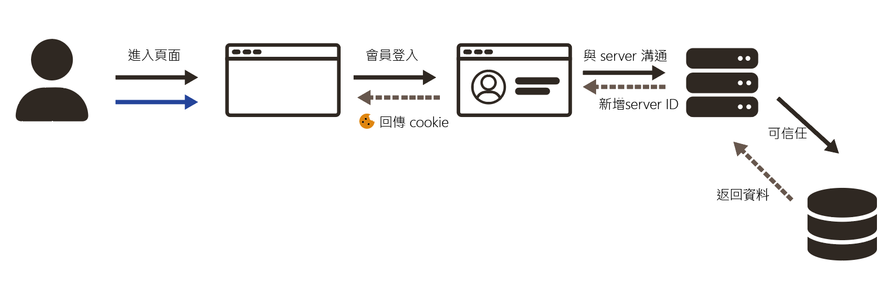
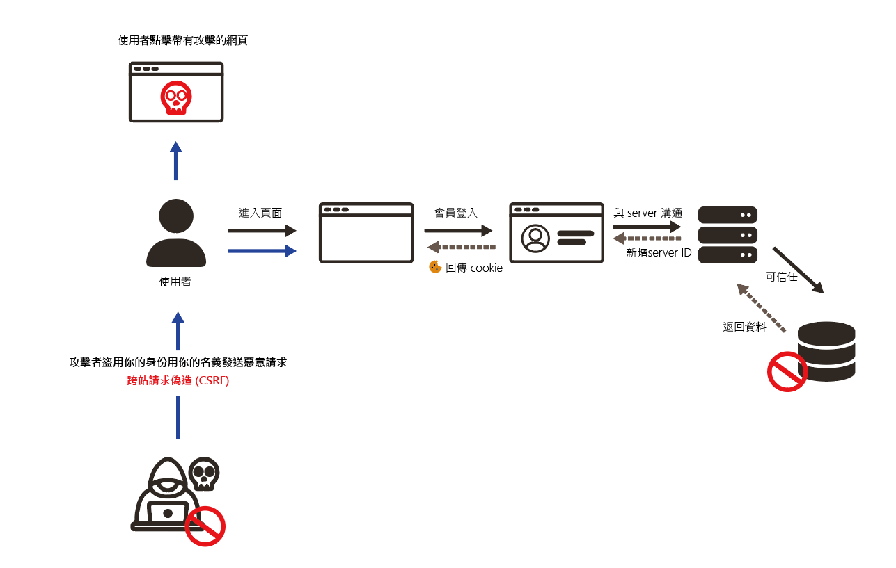
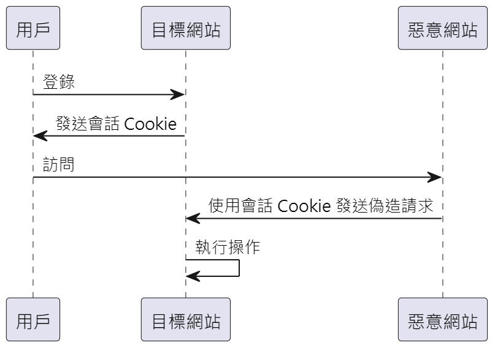
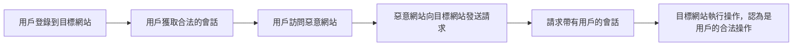
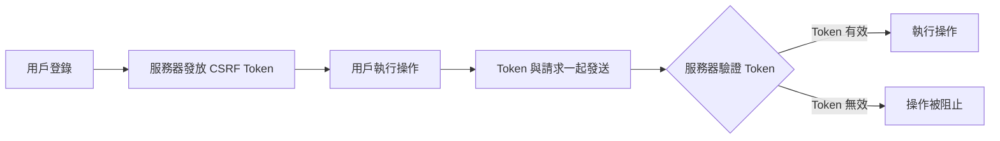

---


這是一個經過優化的 CSRF（跨站點請求偽造）解釋版本，將其結構化並簡化，以更好地傳達關鍵概念和防禦措施：

---

### **什麼是 CSRF？**

跨站點請求偽造（CSRF）是一種攻擊技術，攻擊者利用已經認證的使用者身份發送未經授權的請求。這通常透過社會工程手段（如網路釣魚或誘騙）讓使用者執行未經同意的操作。攻擊者會利用使用者的已認證狀態，欺騙伺服器執行操作，而不需要進一步的驗證。


你的描述大致上是正確的，但可以進一步精確化和補充一些細節，來更清楚地說明一般的登入機制。

---

### **一般登入機制的流程**

1. **用戶提交登入表單**：用戶在登入頁面輸入帳號和密碼，觸發 `POST` 請求，將資料傳送至伺服器進行驗證。
2. **伺服器驗證**：伺服器檢查帳號和密碼是否正確。
3. **生成和發送會話 ID**：驗證成功後，伺服器生成唯一的 `Session ID`，並透過 `Set-Cookie` 標頭將其存儲在瀏覽器中。
4. **資料庫操作和回應**：伺服器撈取相關用戶資料並返回給前端，以顯示在用戶界面上。
5. **後續請求**：瀏覽器會自動攜帶 `Session ID`，以維持用戶的登入狀態。

---



<!-- _\*\*流程圖_
 -->



**以上是被攻擊的版本：**

> 當使用者點擊含有惡意攻擊的網站，而你的網頁 Cookie 恰好沒有定期清除或server ID 是固定的，那麼你可能會遭受攻擊。CSRF（跨站請求偽造）漏洞會出現於易受攻擊的 Web 應用程式僅信任 Web 瀏覽器發送的 Cookie 而未進行進一步驗證時。


---

### **CSRF 攻擊的場景和影響**

#### **攻擊場景：**
1. 用戶登入到目標網站，並獲取合法的會話。
2. 用戶不知情地訪問惡意網站。
3. 惡意網站向目標網站發送請求，這些請求會自動攜帶用戶的會話 ID。
4. 目標網站無法辨別這些請求的來源，認為它們是用戶的合法操作，進而執行這些請求。


#### **潛在影響：**
- **發送訊息或郵件**：攻擊者可偽裝成用戶發送信息。
- **盜取帳號**：攻擊者可能修改用戶密碼或其他敏感資料。
- **購買物品或轉移資產**：利用用戶帳戶進行購物或轉移虛擬幣。
- **修改用戶資料**：包括個人信息和帳戶設置的變更。
- **執行敏感操作**：如添加新用戶或刪除數據。

```code
<form method="POST" action="/submit-data">
    <input type="hidden" name="csrf_token" value="random_csrf_token_value">
    <!-- 其他表單字段 -->
    <input type="submit" value="Submit">
</form>

```

### **如何防範 CSRF 攻擊**

1. **使用 CSRF Token**
   - **什麼是 CSRF Token**：這是一個隨機生成的唯一值，嵌入在用戶的每次敏感操作請求中。
   - **如何工作**：伺服器會在收到請求後檢查這個 Token 是否正確，只有驗證通過的請求才會被執行。

   ```html
   <form method="POST" action="/submit-data">
       <input type="hidden" name="csrf_token" value="random_csrf_token_value">
       <!-- 其他表單字段 -->
       <input type="submit" value="Submit">
   </form>
   ```

2. **檢查 Referer 和 Origin 標頭**
   - 檢查請求的來源，確保來自可信的域名，防止來自惡意網站的請求被執行。

3. **雙重提交 Cookie**
   - 同時通過 Cookie 和請求參數傳送 CSRF Token，伺服器檢查這兩者是否匹配。

4. **限制 Cookie 的範圍和有效期**
   - 使用 `HttpOnly` 和 `Secure` 標記來保護 Cookie，並設置 `SameSite` 屬性來限制跨站請求的 Cookie 傳送。

5. **強制使用 POST 請求**
   - 限制敏感操作只能通過 POST 請求觸發，避免 GET 請求引發的攻擊。

6. **實施多因素認證 (MFA)**
   - 在執行高風險操作時要求用戶進行額外的身份驗證，增加攻擊難度。

7. **教育用戶和開發者**
   - 提高用戶和開發者對 CSRF 攻擊的認識，並在應用設計中實施相應的防禦措施。
