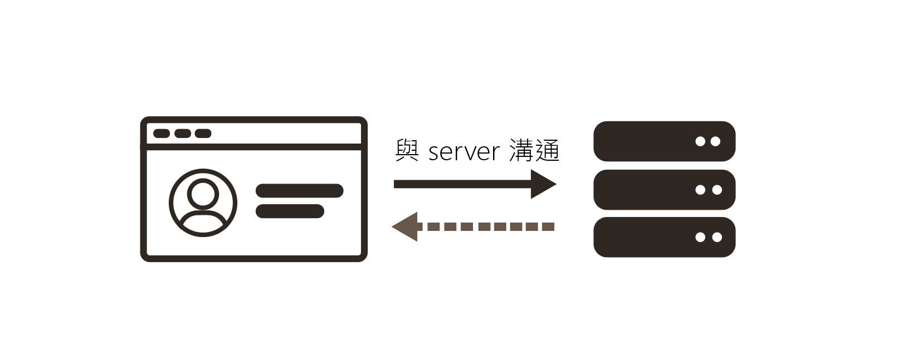
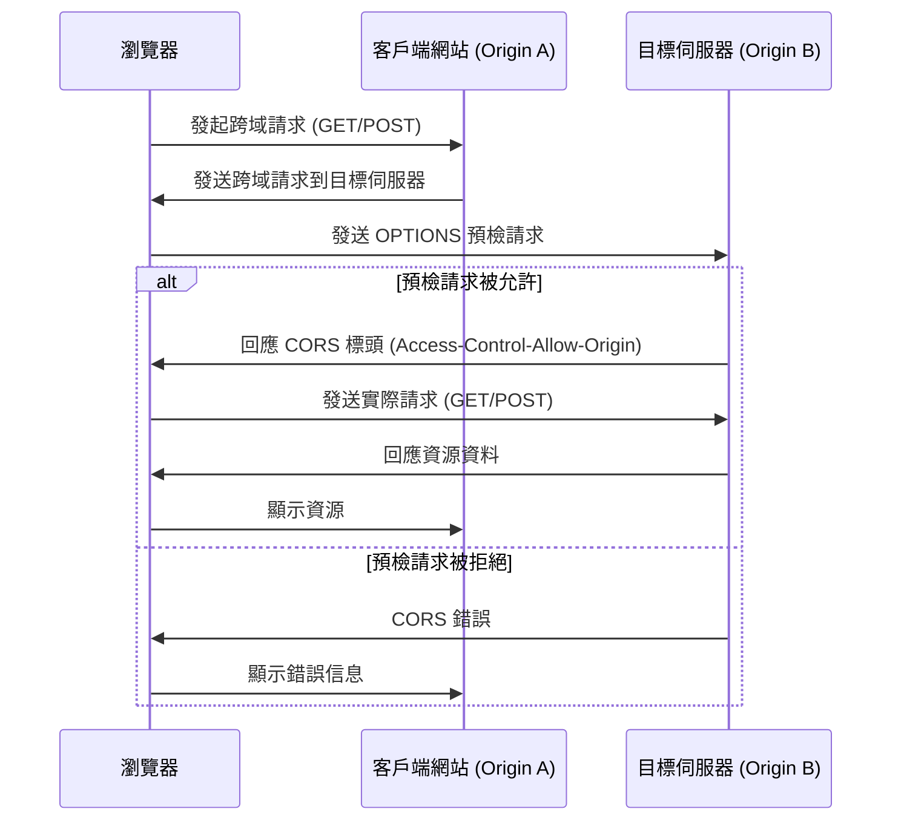

**什麼是跨來源資源共用？**
在一個網域載入的用戶端web應用程式可以與不同網域中資源互動，CORS 定義了瀏覽器和伺服器之間如何安全地處理跨域請求，從而防止惡意網站從其他域名竊取數據。
**跨來源資源共用（Cross-Origin Resource Sharing, CORS）** 是一種網頁瀏覽器的安全功能，用來限制從一個域（origin）向另一個域請求資源的行為。CORS 定義了瀏覽器和伺服器之間如何安全地處理跨域請求，從而防止惡意網站從其他域名竊取數據。




### **什麼是“來源”？**
在 CORS 中，來源（origin）指的是一個網頁的域名、協議（HTTP 或 HTTPS），以及端口號（如果有）的組合。例如：
- `https://www.example.com` 和 `http://www.example.com` 是不同的來源，因為協議不同。
- `https://www.example.com` 和 `https://api.example.com` 是不同的來源，因為子域名不同。
- `https://www.example.com` 和 `https://www.example.com:8080` 是不同的來源，因為端口號不同。

### **CORS 的工作原理**
當一個網站試圖從另一個來源獲取資源時，瀏覽器會先發送一個 **"預檢請求"**（preflight request），確認目標伺服器是否允許這個請求。預檢請求是一個 `OPTIONS` 請求，其中包含請求的方法和標頭等信息。如果伺服器允許跨域請求，它會在回應中包含適當的 CORS 頭部，如 `Access-Control-Allow-Origin`。

#### **常見的 CORS 頭部：**
1. **Access-Control-Allow-Origin**: 指定允許哪些來源的跨域請求，可以是具體的域名或 `*`（代表允許所有域）。
2. **Access-Control-Allow-Methods**: 指定允許的 HTTP 請求方法，如 `GET`、`POST`、`PUT` 等。
3. **Access-Control-Allow-Headers**: 指定允許的自訂標頭，如 `Content-Type`、`Authorization` 等。
4. **Access-Control-Allow-Credentials**: 是否允許跨域請求發送憑證信息（如 Cookie 或 HTTP 驗證資料），值為 `true` 或 `false`。
5. **Access-Control-Max-Age**: 指定瀏覽器可以快取預檢請求的時間，單位為秒。




### **CORS 的重要性**
CORS 是為了保護使用者的數據，防止來自惡意網站的跨域攻擊，例如：
- **CSRF（跨站點請求偽造）**：如果沒有 CORS，攻擊者可能會利用用戶的已認證狀態從其他來源竊取數據或發送惡意請求。
- **資料洩漏**：CORS 防止網頁隨意從不同來源獲取敏感資料。

### **如何配置 CORS**
CORS 設置主要是在伺服器端完成的，具體方式取決於使用的伺服器技術。例如，在 Express.js 中可以這樣設置：

```javascript
const express = require('express');
const cors = require('cors');
const app = express();

// 允許所有來源
app.use(cors());

// 只允許特定來源
app.use(cors({
    origin: 'https://www.example.com',
    methods: ['GET', 'POST'],
    allowedHeaders: ['Content-Type', 'Authorization'],
    credentials: true
}));

app.listen(3000, () => {
    console.log('Server running on port 3000');
});
```

> CORS 是現代 Web 安全的一部分，它允許合法的跨域資源請求，同時保護用戶免受潛在的跨域攻擊。正確配置 CORS 頭部對於保護應用和用戶的安全至關重要。