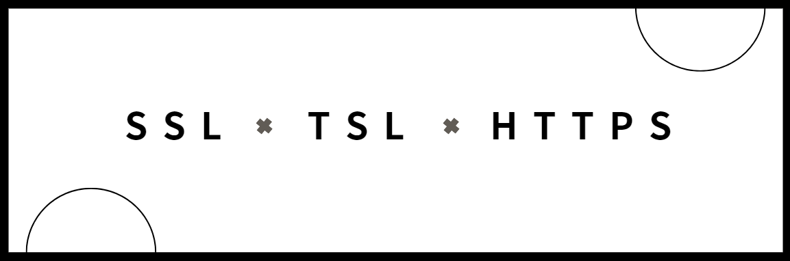

你在一個網上商店（例如亞馬遜）購物。在結帳過程中，你需要輸入信用卡信息。商店的網站使用 HTTPS 協議，這樣你的信用卡信息在傳輸過程中會被加密。這樣即使有人截取了數據，也無法輕易解讀你的信用卡號碼和其他敏感信息。

- 數據加密：保護支付信息和個人數據不被竊取。
- 驗證網站：確保你是在正確的商店網站上進行交易，避免網絡釣魚。

### 分別解釋

1. **HTTP（超文本傳輸協議，HyperText Transfer Protocol）**：
   - HTTP 是一種用於在網絡上傳輸數據的協議。它定義了客戶端（如瀏覽器）和伺服器之間如何傳輸請求和響應。
   - HTTP 不加密數據，這意味著它在傳輸過程中不提供安全保護。

2. **HTTPS（安全超文本傳輸協議，HyperText Transfer Protocol Secure）**：
   - HTTPS 是 HTTP 的安全版本。它在 HTTP 的基礎上加了一層加密，以保護數據在網絡傳輸過程中的安全。
   - HTTPS 使用 SSL 或 TLS 協議來加密 HTTP 數據，使得通信過程中的數據難以被竊聽或篡改。

3. **SSL（安全套接字層，Secure Sockets Layer）**：
   - SSL 是一種早期的加密協議，用於在網絡上保護數據傳輸的安全。
   - SSL 現在已經被 TLS 替代，並且被認為是不再安全的。

4. **TLS（傳輸層安全性，Transport Layer Security）**：
   - TLS 是 SSL 的後繼者，提供了改進的加密和安全功能。它用於保護網絡通信，確保數據的私密性和完整性。
   - 現代的 HTTPS 協議實際上使用的是 TLS，而不是 SSL。

> 總結來說，HTTP 是一個基本的傳輸協議，而 HTTPS 是其安全版本，通過使用 SSL 或 TLS 來加密傳輸數據。
> 使用 HTTPS 和 TLS 的主要目的是確保網絡通信的安全性和隱私

---

### **為什麼要使用 HTTPS 和 TLS**

1. **保護數據安全**：
   - HTTPS 和 TLS 加密網絡通信中的數據，防止數據在傳輸過程中被竊聽、篡改或偽造。這是保護敏感信息（如密碼、信用卡號）不被未經授權的人士獲取的關鍵。

2. **驗證網站身份**：
   - HTTPS 使用數字證書來驗證網站的身份。這意味著用戶可以確認他們連接的是正確的網站，而不是假冒的網站或網絡釣魚網站。

3. **提高用戶信任**：
   - 當用戶看到瀏覽器地址欄中的鎖形圖標或 "https://" 前綴時，他們會感到網站是安全的，這有助於提高用戶的信任和滿意度。

4. **防止數據篡改**：
   - 加密通信不僅保護數據不被竊聽，還防止數據在傳輸過程中被篡改或注入惡意代碼。

5. **符合合規要求**：
   - 許多法律和規範要求對敏感數據進行加密，以保護用戶隱私。使用 HTTPS 和 TLS 幫助滿足這些合規要求。

---

### **用在哪裡**

1. **網站**：
   - 大多數現代網站都使用 HTTPS 來保護與用戶的通信，特別是處理敏感信息的網站（如電商平台、網上銀行）。

2. **應用程序**：
   - 許多應用程序和服務（例如電子郵件客戶端、即時消息應用）使用 TLS 來保護數據傳輸過程中的安全性。

3. **API 服務**：
   - 提供 API 的服務器使用 HTTPS 來保護 API 調用過程中的數據安全，防止不安全的數據傳輸。

4. **內部網絡**：
   - 即使在內部網絡中，許多企業也選擇使用 TLS 來保護內部通信，防止潛在的內部安全威脅。

總的來說，HTTPS 和 TLS 是確保網絡通信安全的基本工具，它們在保護數據傳輸、驗證網站身份、提高用戶信任等方面發揮了重要作用。