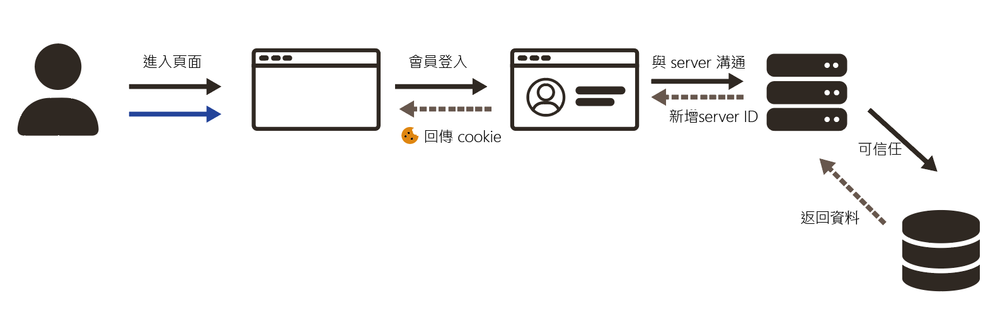
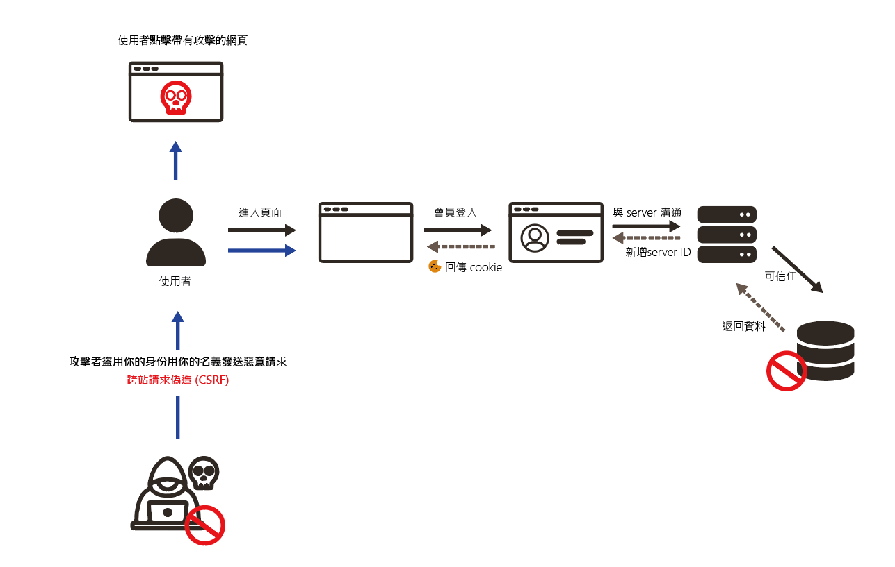
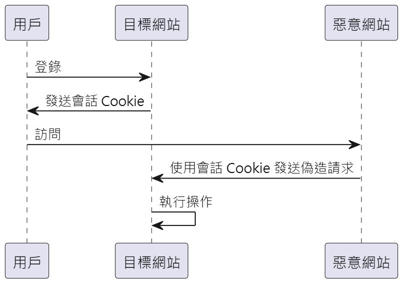
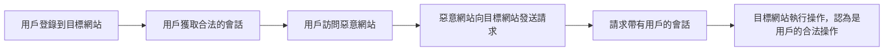
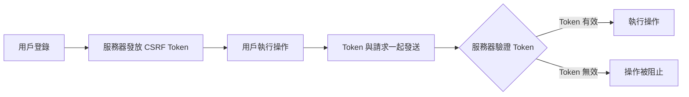

---

## 你知道什麼是 CSRF 攻擊嗎?

### CSRF(Cross Site Request Forery)跨站點請求偽造，他可以做的事以下 :

-   **發送訊息或郵件**：攻擊者可以利用已登入的身份，偽裝成用戶，發送訊息或郵件給其他人。
-   **盜取帳號**：在某些情況下，CSRF 攻擊可能導致帳號被盜取，尤其是如果攻擊者能夠修改用戶的密碼或其他敏感資料。
-   **購買物品**：攻擊者可以利用用戶的帳號在網上商店購買物品，導致用戶財務損失。
-   **轉移虛擬幣**：如果用戶在虛擬貨幣交易平台上已登入，攻擊者可以在未經用戶同意的情況下將虛擬幣轉移到其他賬戶。
-   **修改用戶資料**：攻擊者可以利用 CSRF 攻擊來修改用戶的個人資料，比如更改郵寄地址、電子郵件地址、電話號碼等，這些行為可能進一步導致個人隱私洩露或後續的社會工程攻擊。
-   **修改帳戶設置**：攻擊者可以更改帳戶設置，例如更改密碼、設置轉帳限額或取消雙因素驗證，這可能會讓攻擊者更容易進行進一步的攻擊。
-   **執行敏感操作**：在企業應用中，CSRF 攻擊可能被用來在管理控制面板中執行敏感操作，比如添加新用戶、升級用戶權限、或刪除重要的數據。
-   **提交惡意表單**：\*\*攻擊者可以利用 CSRF 強迫用戶提交帶有惡意數據的表單，這可能導致應用程序的數據庫被污染或應用程序的行為被更改。
-   **取消服務或訂閱**：攻擊者可以通過 CSRF 攻擊來強制用戶取消服務或訂閱，這可能會導致用戶失去對某些關鍵服務的訪問權限。
-   **投票操控**：在網上投票系統中，攻擊者可以利用 CSRF 攻擊來操控投票結果，使得某一方獲得不公平的優勢。
-   **劫持連結點擊行為**：攻擊者可以誘導用戶點擊某些惡意連結，進行未經授權的操作，這在某些情況下會導致用戶進入釣魚網站或觸發進一步的攻擊。
    總和以上如果你發生 CSRF 攻擊就是產生個人隱私洩漏或這財產安全問題

---

### 範例說明


你的描述大致上是正確的，但可以進一步精確化和補充一些細節，來更清楚地說明一般的登入機制。

---

**一般登入機制的流程：**

1. **用戶提交登入表單**：用戶在網站的登入頁面上輸入帳號和密碼，並點擊「登入」按鈕。這個操作會觸發一個 `POST` 請求，該請求將包含用戶輸入的帳號和密碼作為 `object` 傳送到伺服器進行驗證。

2. **伺服器驗證**：伺服器接收到 `POST` 請求後，會對帳號和密碼進行驗證。這通常包括以下步驟：
    - 檢查提交的帳號是否存在於數據庫中。
    - 將用戶提交的密碼與數據庫中存儲的（通常是哈希後的）密碼進行比對。
3. **生成和發送會話 ID（Session ID）**：

    - 如果驗證成功，伺服器會生成一個唯一的 `Session ID`（會話 ID），這個 ID 將用來標識用戶的會話狀態。
    - 伺服器會將這個 `Session ID` 回傳給前端，並通過 `Set-Cookie` 標頭將其存儲在用戶的瀏覽器中。這樣，用戶在接下來的每次請求中都會自動攜帶這個 `Session ID`，以表明用戶已經登入。

4. **資料庫操作和回應**：

    - 驗證成功後，伺服器可以根據用戶的身份從數據庫中撈取相關資料，這些資料可能包括用戶個人資訊、偏好設置等。
    - 最終，伺服器會將這些資料作為回應的一部分返回給前端，用於在用戶介面中顯示。

5. **後續請求**：
    - 在後續的請求中，瀏覽器會自動攜帶存儲在 `Cookie` 中的 `Session ID`，伺服器會根據這個 `Session ID` 來識別用戶的身份並維持用戶的登入狀態。

---



_\*\*流程圖_




**以上是被攻擊的版本：**

> 使用者點擊帶有攻擊的網站恰好你的 web 的 cookie 不會定期清除 或這 server ID 是固定的你就被攻擊了

## 那如何防範 CSRF 攻擊?

防範 CSRF（跨站點請求偽造）攻擊是保障網絡應用安全的重要部分。以下是一些常用的方法來防止 CSRF 攻擊：



#### 1. **使用 CSRF Token**

-   **什麼是 CSRF Token**: CSRF Token 是一個隨機生成的、唯一的值，每次用戶請求需要修改資料的操作時，伺服器都會將這個 Token 與請求一同發送到用戶端。用戶端必須在後續的請求中將這個 Token 一併發送回伺服器，以驗證請求的合法性。
-   **如何工作**: 當用戶在提交表單或進行某些敏感操作（如更新資料、刪除項目）時，這個 Token 被嵌入在表單中，並隨同請求一同發送給伺服器。伺服器會檢查這個 Token 是否正確，只有在 Token 驗證通過的情況下才會執行相應的操作。

```code
<form method="POST" action="/submit-data">
    <input type="hidden" name="csrf_token" value="random_csrf_token_value">
    <!-- 其他表單字段 -->
    <input type="submit" value="Submit">
</form>

```

#### 2. **檢查 Referer 和 Origin 標頭**

-   **什麼是 Referer 和 Origin 標頭**: `Referer` 和 `Origin` 是 HTTP 標頭，用來指出請求的來源。檢查這些標頭可以確保請求來自可信的來源。
-   **如何工作**: 在敏感操作（例如金融交易或修改帳戶信息）中，伺服器可以檢查這些標頭，確保請求來自該應用的域名，而不是來自惡意網站。如果 `Referer` 或 `Origin` 標頭不匹配，伺服器可以拒絕這個請求。

#### 3. **使用雙重提交 Cookie**

-   **什麼是雙重提交 Cookie**: 這種方法涉及在發送 `POST` 請求時，將 CSRF Token 同時以 Cookie 和請求參數的形式傳送。
-   **如何工作**: 當用戶發送請求時，CSRF Token 會作為 Cookie 送出，並同時作為請求參數（例如表單字段或 URL 參數）送回伺服器。伺服器檢查這兩個 Token 是否匹配，若匹配則允許請求繼續，否則拒絕。

#### 4. **限制 Cookie 的範圍和有效期**

-   **使用 HttpOnly 和 Secure 標記**: 在設置 Cookie 時，將 `HttpOnly` 標記加上，這樣 JavaScript 無法訪問 Cookie，從而防止 XSS 攻擊利用這些 Cookie。`Secure` 標記則要求 Cookie 只能在 HTTPS 連接中傳輸。
-   **設定 SameSite 屬性**: `SameSite` Cookie 屬性可以設置為 `Strict` 或 `Lax`，來限制 Cookie 在跨站請求中的發送，從而減少 CSRF 攻擊的風險。

#### 5. **強制使用 POST 請求**

-   **限制 GET 請求的敏感操作**: 確保敏感操作只能通過 `POST` 請求觸發，而不是 `GET` 請求，因為 `GET` 請求更容易被 CSRF 攻擊利用。

#### 6. **實施多因素認證 (MFA)**

-   **多因素認證**: 在執行高風險操作時，要求用戶進行額外的身份驗證（如短信驗證碼或硬體令牌），即使 CSRF 攻擊成功，攻擊者也無法輕易進行操作。

####s 7. **教育用戶和開發者**

-   **用戶教育**: 提醒用戶不要點擊來歷不明的鏈接，並且在使用敏感應用時保持警惕。
-   **開發者教育**: 確保開發者瞭解 CSRF 攻擊的風險和防禦技術，並在應用設計時實施這些措施。
