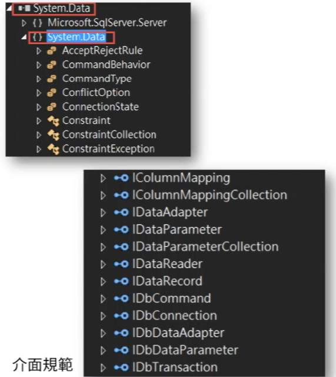

1. ADO.NET 是一個 Framework , 不單純只使用若干的類別庫
2. 具有一套的軟體工程基礎，可支援其他資料庫提供者進行 Database API 開發
3. 採用 Interface 介面作為方法與屬性統一規範的定義
4. .net Framework 基準類別庫 System.Data.dll
5. SQL Server .net Data Provider System.Data.SqlClient

### 抽象類別 Adapter

1. 任何的 .net Data Provider 類別無須採用實作介面
2. 透過抽象類別作為 Adapter 軟體工程，衍生不同資料庫伺服器的 .net Data Provider API
3. System.DataCommon namespace

### 不同類型資料庫 Provider
1. SQL Server .net Data Provider 類別庫
2. 其他資料庫需要網資料庫提供者官網下載
    - 如 MySQL-System.Data.Mysql.dll
3. SQL Server 採用 三種 Database API 
    - System.Data.Odbc
    - System.Data.OleDb
    - System.Data.SqlClient (效能校佳)
